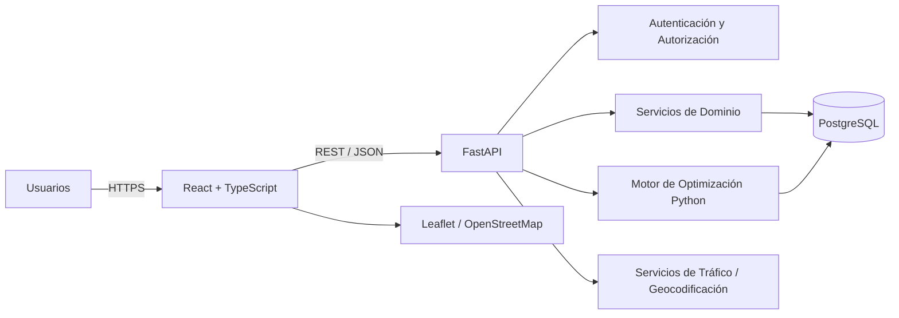

# EcoLogística Lima

**EcoLogística Lima** es un proyecto de software orientado a la optimización sostenible de rutas de distribución de última milla para el escenario empresarial de **DistriRápido S.A.C.**

La solución busca mejorar la planificación logística mediante la gestión de pedidos, vehículos y conductores, generación de rutas optimizadas, re-optimización ante incidencias, visualización cartográfica e indicadores económicos y ambientales.

---

## Objetivo

Diseñar y desarrollar un MVP capaz de optimizar rutas de distribución considerando simultáneamente:

- Distancia recorrida.
- Tiempo de entrega.
- Capacidad de los vehículos.
- Ventanas de tiempo.
- Disponibilidad de conductores.
- Consumo de combustible.
- Emisiones de CO₂.
- Prioridad de pedidos.
- Restricciones de seguridad e infraestructura vial.
- Cambios operativos durante la ejecución.

---

## Alcance del MVP

El sistema contempla los siguientes módulos:

1. Gestión de flota.
2. Gestión de pedidos.
3. Generación de rutas optimizadas.
4. Visualización de rutas en mapa.
5. Dashboard de indicadores.
6. Reportes de sostenibilidad.
7. Re-optimización dinámica.
8. Gestión de conductores.
9. Gestión de clientes.
10. Seguimiento de emisiones.

---

## Stack Tecnológico

| Capa | Tecnología |
|---|---|
| Frontend | React + TypeScript |
| Backend | Python + FastAPI |
| Base de datos | PostgreSQL |
| Optimización | Python |
| Mapas | Leaflet + OpenStreetMap |
| API | REST / JSON |
| Documentación API | OpenAPI |
| Pruebas Backend | Pytest |
| Pruebas Frontend | Vitest / React Testing Library |
| Contenedores | Docker |
| CI/CD | GitHub Actions |

---

## Arquitectura General



La arquitectura utiliza separación entre:

- Interfaz de usuario.
- API.
- Servicios de dominio.
- Motor de optimización.
- Persistencia.
- Integraciones externas.

---

## Requisitos Clave

### Rendimiento

- Generación de rutas: **≤ 45 segundos** para hasta 150 pedidos y 15 vehículos.
- Re-optimización: **< 30 segundos**.

### Escalabilidad

La arquitectura debe contemplar crecimiento hasta:

- **1,000 pedidos diarios**.
- **50 vehículos**.

### Disponibilidad

- Objetivo: **99.5%** durante el horario operativo de 5:00 AM a 10:00 PM.

### Seguridad

- Autenticación.
- Autorización RBAC/ABAC.
- HTTPS/TLS.
- Protección frente a OWASP Top 10.
- Auditoría de operaciones críticas.

### Accesibilidad

- WCAG 2.1 nivel AA.

---

## Usuarios Principales

| Rol | Responsabilidad |
|---|---|
| Administrador | Usuarios, roles y configuración |
| Operador Logístico | Pedidos, flota y generación de rutas |
| Supervisor | Supervisión de rutas e indicadores |
| Conductor | Consulta de rutas y paradas asignadas |
| Gerencia | KPIs, costos y sostenibilidad |
| Auditor | Consulta de trazabilidad |

---

## Estructura Documental

```text
EcoLog-stica-Lima/
│
├── README.md
│
└── docs/
    └── 01 Inicio/
        ├── 01. Selección del enfoque del proyecto V_1_0_0.md
        ├── 02. Acta de constitución V_1_0_0.md
        ├── 03. Declaración de la visión V_1_0_0.md
        ├── 04. Registro de supuestos y restricciones V_1_0_0.md
        ├── 05. Registro de interesados V_1_0_0.md
        ├── 06. Requisitos funcionales V_1_0_0.md
        ├── 07. Requisitos no funcionales V_1_0_0.md
        ├── 08. Usuarios V_1_0_0.md
        ├── 09. Reglas de negocio V_1_0_0.md
        ├── 10. Stack tecnológico V_1_0_0.md
        ├── 11. Base de datos V_1_0_0.md
        ├── 12. Modelo C4 V_1_0_0.md
        └── 13. Restricciones V_1_0_0.md
```

---

## Documentación del Proyecto

| Documento | Contenido |
|---|---|
| 01 | Selección y justificación del enfoque híbrido |
| 02 | Acta de constitución |
| 03 | Visión del producto |
| 04 | Supuestos y restricciones |
| 05 | Registro de interesados |
| 06 | Requisitos funcionales |
| 07 | Requisitos no funcionales |
| 08 | Usuarios, roles y permisos |
| 09 | Reglas de negocio y trazabilidad |
| 10 | Evaluación y selección del stack |
| 11 | Diseño de base de datos |
| 12 | Arquitectura C4 |
| 13 | Análisis multidimensional de restricciones |

---

## Modelo de Datos Principal

La base de datos contempla, entre otras, las siguientes entidades:

- Usuarios.
- Roles.
- Vehículos.
- Conductores.
- Clientes.
- Pedidos.
- Rutas.
- Paradas.
- Incidencias.
- Registros de emisiones.
- Auditoría.

PostgreSQL se utiliza como sistema gestor principal y se contempla **PostGIS** como extensión futura en caso de requerirse consultas geoespaciales avanzadas.

---

## API

El backend se plantea como una API REST desarrollada con FastAPI.

Principales grupos de recursos:

```text
/api/v1/auth
/api/v1/usuarios
/api/v1/roles
/api/v1/vehiculos
/api/v1/conductores
/api/v1/clientes
/api/v1/pedidos
/api/v1/rutas
/api/v1/incidencias
/api/v1/dashboard
/api/v1/emisiones
/api/v1/reportes
/api/v1/auditoria
```

FastAPI permitirá generar documentación OpenAPI para facilitar la validación e integración del frontend.

---

## Motor de Optimización

El componente de optimización se mantiene separado de la capa HTTP.

El motor debe considerar variantes de:

- Vehicle Routing Problem.
- VRPTW.
- Green VRP.
- Optimización multiobjetivo.

Los principales criterios de evaluación serán:

- Distancia.
- Tiempo.
- Combustible.
- Emisiones.
- Penalizaciones.
- Cumplimiento de ventanas.
- Capacidad.
- Seguridad.

---

## Equipo

- Luis Antony Gonzalo Guerrero
- Jhon Robert Paitan Montes
- Marco Jhair Martinez Llanos
- Rodrigo Vladimir Arce Curi

---

## Estado

**Fase actual:** Inicio, arquitectura e ingeniería de requisitos.

Los documentos de definición inicial del proyecto se encuentran dentro de `docs/01 Inicio/`.

---

## Licencia

Proyecto académico desarrollado como parte del Proyecto Final de Asignatura.
