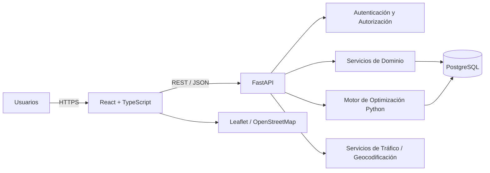

# EcoLogística Lima

**Versión de este README:** 1.1.0 · **Actualizado:** 06/10/2026

**EcoLogística Lima** es un proyecto de software orientado a la optimización sostenible de rutas de distribución de última milla para el escenario empresarial de **DistriRápido S.A.C.**

La solución busca mejorar la planificación logística mediante la gestión de pedidos, vehículos y conductores. La generación de rutas optimizadas, re-optimización ante incidencias, visualización cartográfica e indicadores económicos y ambientales pertenecen a etapas posteriores del MVP.

---

## Objetivo

Diseñar y desarrollar un MVP capaz de optimizar rutas de distribución considerando simultáneamente:

- Distancia recorrida.
- Tiempo de entrega.
- Capacidad de los vehículos.
- Ventanas de tiempo.
- Disponibilidad de conductores.
- Consumo de combustible.
- Emisiones de CO₂.
- Prioridad de pedidos.
- Restricciones de seguridad e infraestructura vial.
- Cambios operativos durante la ejecución.

---

## Alcance del MVP

El sistema contempla los siguientes módulos:

1. Gestión de flota.
2. Gestión de pedidos.
3. Generación de rutas optimizadas.
4. Visualización de rutas en mapa.
5. Dashboard de indicadores.
6. Reportes de sostenibilidad.
7. Re-optimización dinámica.
8. Gestión de conductores.
9. Gestión de clientes.
10. Seguimiento de emisiones.

---

## Stack Tecnológico

| Capa | Tecnología |
|---|---|
| Frontend | React + TypeScript |
| Backend | Python + FastAPI |
| Base de datos | PostgreSQL |
| Optimización futura | Python |
| Mapas futuros | Leaflet + OpenStreetMap |
| API | REST / JSON |
| Documentación API | OpenAPI |
| Pruebas Backend | Pytest |
| Pruebas Frontend | Vitest / React Testing Library |
| Contenedores | Docker |
| CI/CD previsto | GitHub Actions |

---

## Arquitectura General


```mermaid
flowchart LR
    U[Usuarios] -->|HTTPS| FE[React + TypeScript]

    FE -->|REST / JSON| API[FastAPI]

    API --> AUTH[Autenticación y Autorización]
    API --> DOMAIN[Servicios de Dominio]
    API --> OPT[Motor de Optimización Python]

    DOMAIN --> DB[(PostgreSQL)]
    OPT --> DB

    API --> EXT[Servicios de Tráfico / Geocodificación]
    FE --> MAP[Leaflet / OpenStreetMap]
```

El diagrama representa la arquitectura objetivo del MVP; el Sprint 1 implementa interfaz, API, autenticación, servicios y persistencia. El optimizador, las integraciones externas y el mapa quedan pendientes. La arquitectura utiliza separación entre:

- Interfaz de usuario.
- API.
- Servicios de dominio.
- Motor de optimización.
- Persistencia.
- Integraciones externas.

---

## Requisitos Clave

### Rendimiento

- Generación de rutas: **≤ 45 segundos** para hasta 150 pedidos y 15 vehículos.
- Re-optimización: **< 30 segundos**.

### Escalabilidad

La arquitectura debe contemplar crecimiento hasta:

- **1,000 pedidos diarios**.
- **50 vehículos**.

### Disponibilidad

- Objetivo: **99.5%** durante el horario operativo de 5:00 AM a 10:00 PM.

### Seguridad

- Autenticación.
- Autorización RBAC/ABAC.
- HTTPS/TLS.
- Protección frente a OWASP Top 10.
- Auditoría de operaciones críticas.

### Accesibilidad

- WCAG 2.1 nivel AA.

---

## Usuarios Principales

| Rol | Responsabilidad |
|---|---|
| Administrador | Usuarios, roles y configuración |
| Operador Logístico | Pedidos, flota y generación de rutas |
| Supervisor | Supervisión de rutas e indicadores |
| Conductor | Consulta de rutas y paradas asignadas |
| Gerencia | KPIs, costos y sostenibilidad |
| Auditor | Consulta de trazabilidad |

---

## Estructura del repositorio

```text
EcoLog-stica-Lima/
├── README.md
├── .gitignore
├── .env.example
├── docker-compose.yml
├── src/
│   ├── backend/
│   └── frontend/
└── docs/
    ├── 01 Inicio/
    ├── 02 Planificación/
    └── 03 Implementación/
```

---

## Documentación del Proyecto

| Documento | Contenido |
|---|---|
| 01 | Selección y justificación del enfoque híbrido |
| 02 | Acta de constitución |
| 03 | Visión del producto |
| 04 | Supuestos y restricciones |
| 05 | Registro de interesados |
| 06 | Requisitos funcionales |
| 07 | Requisitos no funcionales |
| 08 | Usuarios, roles y permisos |
| 09 | Reglas de negocio y trazabilidad |
| 10 | Evaluación y selección del stack |
| 11 | Diseño de base de datos |
| 12 | Arquitectura C4 |
| 13 | Análisis multidimensional de restricciones |

### Entregables del Sprint 1

| Documento | Enlace relativo |
|---|---|
| Informe de estado del proyecto | [01 Informe de estado del proyecto V_1_0_0](<docs/03 Implementación/01 Informe de estado del proyecto V_1_0_0.md>) |
| Registro de impedimentos | [02 Registro de Impedimentos V_1_0_0](<docs/03 Implementación/02 Registro de Impedimentos V_1_0_0.md>) |
| Revisión del Sprint | [03 Revisión del Sprint V_1_0_0](<docs/03 Implementación/03 Revisión del Sprint V_1_0_0.md>) |
| Retrospectiva del Sprint | [04 Retrospectiva del Sprint V_1_0_0](<docs/03 Implementación/04 Retrospectiva del Sprint V_1_0_0.md>) |

La revisión documenta el estado **antes** de la presentación del 29/09/2026. La retrospectiva contiene un análisis y plan de acción; sus responsables y acuerdos requieren confirmación del equipo.

Para ejecutar el proyecto, consultar las instrucciones técnicas del [backend](src/backend/README.md) y el [frontend](src/frontend/README.md). Los criterios oficiales de aceptación y el Definition of Done están en [Transformando a ágil](<docs/02 Planificación/01 Transformando a ágil V_1_0_1.md>). Las capturas de planificación, identificadas según su contenido real, están en [Artefactos Jira](<docs/02 Planificación/02 Artefactos Jira V_1_0_1.md>).

La verificación técnica del 29/09/2026 pasó con Docker Compose, PostgreSQL aislado, API y frontend: 9 pruebas backend (91,35 % de cobertura), 4 pruebas frontend, build y un recorrido HTTP de US-001 a US-010. La interfaz cargó y navegó sin desbordamiento horizontal a 360 px en el navegador probado. A las 15:04 (hora de Lima) se repitieron el arranque, las pruebas y el build en otro proyecto Compose aislado. La demostración ante interesados y la reunión de retrospectiva del equipo siguen sin evidencia de realización.

---

## Modelo de Datos Principal

La base de datos contempla, entre otras, las siguientes entidades:

- Usuarios.
- Roles.
- Vehículos.
- Conductores.
- Clientes.
- Pedidos.
- Rutas.
- Paradas.
- Incidencias.
- Registros de emisiones.
- Auditoría.

PostgreSQL se utiliza como sistema gestor principal y se contempla **PostGIS** como extensión futura en caso de requerirse consultas geoespaciales avanzadas.

---

## API

El backend del Sprint 1 es una API REST desarrollada con FastAPI.

Grupos de recursos de la arquitectura objetivo (`auth`, `vehiculos`, `pedidos`, `conductores` y `clientes` están implementados hasta el Sprint 2):

```text
/api/v1/auth
/api/v1/usuarios
/api/v1/roles
/api/v1/vehiculos
/api/v1/conductores
/api/v1/clientes
/api/v1/pedidos
/api/v1/rutas
/api/v1/incidencias
/api/v1/dashboard
/api/v1/emisiones
/api/v1/reportes
/api/v1/auditoria
```

FastAPI permitirá generar documentación OpenAPI para facilitar la validación e integración del frontend.

---

## Motor de Optimización

El componente de optimización se mantiene separado de la capa HTTP.

El motor debe considerar variantes de:

- Vehicle Routing Problem.
- VRPTW.
- Green VRP.
- Optimización multiobjetivo.

Los principales criterios de evaluación serán:

- Distancia.
- Tiempo.
- Combustible.
- Emisiones.
- Penalizaciones.
- Cumplimiento de ventanas.
- Capacidad.
- Seguridad.

---

## Equipo

- Luis Antony Gonzalo Guerrero
- Jhon Robert Paitan Montes
- Marco Jhair Martinez Llanos
- Piero Pool Chauris Leguia
- Rodrigo Vladimir Arce Curi

La lista actual de cinco integrantes fue confirmada por el usuario mediante una imagen el 29/09/2026. Los documentos iniciales enumeran cuatro; falta confirmar desde cuándo participa Piero antes de corregir registros históricos.

---

## Estado

**Fase actual:** implementación técnica del Sprint 2 en la rama `sprint-2`. El incremento incorpora US-011 a US-015 sobre la base validada del Sprint 1.

Los documentos de definición inicial se encuentran en `docs/01 Inicio/`, la planificación en `docs/02 Planificación/` y los entregables de esta iteración en `docs/03 Implementación/`.

## Historial de control de cambios del README

| Versión | Fecha | Cambio |
|---|---|---|
| 1.0.0 | 29/09/2026 | Actualización del estado del Sprint 1, distinción entre alcance implementado y objetivo del MVP, y enlaces a los cuatro entregables. |
| 1.0.1 | 29/09/2026 | Enlaces a la planificación revisada y resultado de la verificación integrada en Docker y navegador. |
| 1.0.2 | 29/09/2026 | Actualización del equipo actual a cinco integrantes y referencia al análisis retrospectivo ampliado. |
| 1.0.3 | 29/09/2026 | Ajuste de la descripción del análisis retrospectivo. |
| 1.0.4 | 29/09/2026 | Revalidación técnica del Sprint y actualización del análisis retrospectivo y la revisión. |
| 1.1.0 | 06/10/2026 | Implementación técnica de US-011 a US-015: gestión ampliada de conductores y clientes. |

---

## Licencia

Proyecto académico desarrollado como parte del Proyecto Final de Asignatura.
