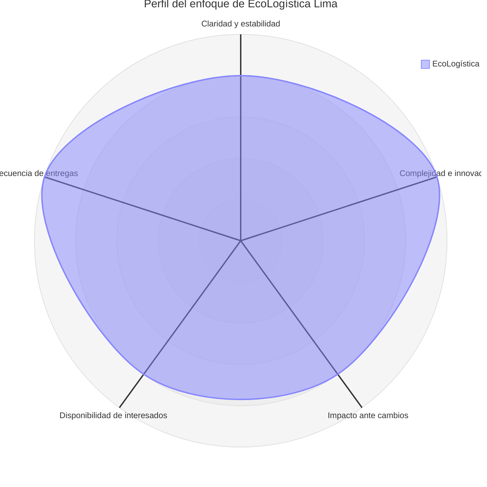

# Selección del Enfoque del Proyecto

| Campo | Detalle |
|---|---|
| **Proyecto** | EcoLogística Lima – Optimizador de Rutas Sostenibles para DistriRápido S.A.C. |
| **Integrantes** | Luis Antony Gonzalo Guerrero, Jhon Robert Paitan Montes, Marco Jhair Martinez Llanos, Rodrigo Vladimir Arce Curi |
| **Fecha** | 25/08/2026 |
| **Versión** | 1.0.0 |

## 1. Objetivo del Documento

Determinar y justificar el enfoque de gestión más adecuado para el proyecto **EcoLogística Lima**, considerando la estabilidad de los requisitos, la complejidad técnica, el impacto de los cambios, la participación de los interesados y la frecuencia esperada de entrega de valor.

## 2. Matriz de Ponderación de Variables

Se utiliza una escala de **1 a 5**, donde los valores bajos representan condiciones más favorables para un enfoque predictivo y los valores altos representan una mayor necesidad de adaptación e iteración.

| Variable requerida | Puntuación | Justificación |
|---|---:|---|
| Claridad y estabilidad de requisitos | 4 | La consigna define requerimientos funcionales, no funcionales, restricciones y entregables mínimos; sin embargo, también exige que estos sean completados y ampliados por el equipo, por lo que pueden evolucionar durante las iteraciones. |
| Complejidad técnica e innovación | 5 | El proyecto integra metaheurísticas para VRPTW/Green VRP, datos georreferenciados, tráfico en tiempo real, re-optimización dinámica, indicadores de sostenibilidad y restricciones locales de Lima. |
| Severidad del impacto ante cambios | 4 | Cambios en fuentes de tráfico, reglas de optimización, restricciones de seguridad, datos o criterios ambientales pueden afectar el algoritmo, la arquitectura, las reglas de negocio y las pruebas. |
| Disponibilidad de los interesados | 4 | El proyecto requiere validación académica y participación de usuarios simulados como conductores y responsables de operaciones, especialmente mediante revisiones y demostraciones por iteración. |
| Frecuencia de entregas de valor | 5 | La consigna establece cuatro iteraciones en 14 semanas, cada una con entregables funcionales o de análisis definidos. |

**Resultado promedio:** 4.4 / 5.

El resultado muestra una fuerte necesidad de adaptación e iteración, aunque existen restricciones y objetivos que deben controlarse de forma predictiva.

## 3. Diagrama de Radar del Enfoque

### Interpretación del Radar

El perfil presenta valores altos en las cinco variables evaluadas. La complejidad técnica y la frecuencia de entrega de valor alcanzan la puntuación máxima, lo que favorece un desarrollo iterativo. Al mismo tiempo, el proyecto posee restricciones claras de tiempo, presupuesto, rendimiento, disponibilidad, accesibilidad y normativa que requieren planificación, seguimiento y control.

## 4. Decisión del Enfoque

**Enfoque seleccionado: HÍBRIDO.**

## 5. Justificación Técnica

El proyecto combina características propias de un entorno predictivo y de un entorno adaptativo.

### Componentes que requieren gestión predictiva

- El proyecto tiene un horizonte de **14 semanas**.
- Existe un presupuesto inicial de desarrollo de **S/ 500,000**, definido como restricción económica de la consigna.
- El MVP debe implementar al menos el **70% de los requerimientos funcionales RF-01 al RF-07**.
- El algoritmo debe generar una solución válida en **45 segundos como máximo** para 150 pedidos y 15 vehículos.
- La re-optimización ante cambios debe realizarse en **menos de 30 segundos**.
- El sistema debe alcanzar **99.5% de disponibilidad** durante el horario operativo de 5:00 AM a 10:00 PM.
- Existen estándares y restricciones definidos, como OWASP Top 10, WCAG 2.1 AA, ISO/IEC 25010, ISO 14083 y las disposiciones normativas indicadas en la consigna.

Estos elementos demandan planificación inicial, hitos, control presupuestal, gestión de riesgos, criterios de aceptación y trazabilidad.

### Componentes que requieren gestión adaptativa

- La metaheurística debe ser evaluada y refinada progresivamente.
- Los requerimientos deben completarse y ampliarse de acuerdo con la realidad operativa de Lima.
- La integración con tráfico en tiempo real posee incertidumbre debido a la cobertura y precisión variable de las fuentes externas.
- La experiencia del conductor requiere validación iterativa de usabilidad.
- Las rutas deben responder dinámicamente a nuevos pedidos, cancelaciones, accidentes y averías.
- La solución debe incorporar aprendizaje técnico progresivo durante las cuatro iteraciones.

## 6. Alineación con PMBOK 7.ª Edición

La elección del enfoque híbrido se alinea con el principio de **adaptación o tailoring** de PMBOK 7.ª edición. El método de trabajo debe ajustarse al contexto, la complejidad, la incertidumbre y las necesidades del proyecto.

El enfoque seleccionado también favorece:

- **Entrega de valor:** cada iteración produce un avance verificable.
- **Participación de interesados:** las revisiones y demostraciones permiten obtener retroalimentación.
- **Adaptabilidad y resiliencia:** el equipo puede responder a cambios técnicos y operativos.
- **Calidad:** los requisitos no funcionales y estándares se mantienen como criterios de control.
- **Gestión de incertidumbre:** los riesgos relacionados con tráfico, datos, algoritmo e infraestructura se revisan de manera continua.

## 7. Aplicación del Enfoque Híbrido

| Componente | Tratamiento de gestión |
|---|---|
| Presupuesto de S/ 500,000 | Predictivo: techo presupuestal y control por iteración |
| Duración de 14 semanas | Predictivo: plazo y principales hitos definidos |
| Alcance mínimo del MVP | Predictivo: al menos 70% de RF-01 a RF-07 |
| Requisitos no funcionales | Predictivo: criterios medibles de aceptación |
| Metaheurística | Adaptativo: prototipado, evaluación y refinamiento |
| Integración de tráfico | Adaptativo: pruebas progresivas con fuentes externas |
| Experiencia del conductor | Adaptativo: validación mediante demos y retroalimentación |
| Re-optimización dinámica | Adaptativo: experimentación y mejora |
| Gestión de riesgos | Híbrido: identificación inicial y revisión en cada iteración |
| Entregas | Adaptativo: incrementos funcionales al cierre de cada iteración |

## 8. Conclusión

El **enfoque híbrido** es el más adecuado porque permite conservar el control de presupuesto, tiempo, alcance mínimo, calidad y restricciones, mientras se desarrolla de manera iterativa la parte de mayor incertidumbre técnica. Esta combinación responde mejor a la naturaleza del proyecto EcoLogística Lima y al cronograma adaptativo definido en la consigna.
