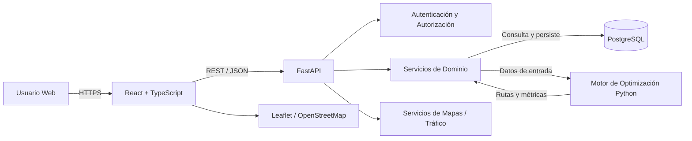

# Stack Tecnológico

| Campo | Detalle |
|---|---|
| **Proyecto** | EcoLogística Lima – Optimizador de Rutas Sostenibles para DistriRápido S.A.C. |
| **Integrantes** | Luis Antony Gonzalo Guerrero, Jhon Robert Paitan Montes, Marco Jhair Martinez Llanos, Rodrigo Vladimir Arce Curi |
| **Fecha** | 01/09/2026 |
| **Versión** | 1.0.0 |

## 1. Objetivo del Documento

Evaluar y seleccionar el stack tecnológico más adecuado para el desarrollo de **EcoLogística Lima**, considerando criterios técnicos, operativos, económicos, de mantenibilidad, escalabilidad, seguridad, sostenibilidad y adecuación al perfil del equipo.

La selección debe responder a las características principales del proyecto:

- Optimización de rutas mediante metaheurísticas.
- Gestión de pedidos, flota, conductores y clientes.
- Visualización geográfica de rutas.
- Re-optimización dinámica.
- Dashboard de indicadores.
- Reportes de sostenibilidad.
- Escalabilidad hasta 1,000 pedidos diarios y 50 vehículos.
- Requisitos de rendimiento de hasta 45 segundos para planificación y menos de 30 segundos para re-optimización.
- Aplicación web responsive.
- Persistencia relacional.
- Integración con servicios externos de mapas y tráfico.
- Necesidad de mantener un consumo de recursos controlado.

---

## 2. Criterios de Evaluación

| ID | Criterio | Descripción | Peso |
|---|---|---|---:|
| CT-01 | Adecuación al problema de optimización | Facilidad para implementar algoritmos, metaheurísticas y procesamiento de datos | 20% |
| CT-02 | Rendimiento | Capacidad del stack para responder a los requisitos del sistema | 15% |
| CT-03 | Escalabilidad | Capacidad para crecer en volumen de usuarios, pedidos y procesamiento | 10% |
| CT-04 | Curva de aprendizaje | Complejidad relativa para el equipo de desarrollo | 10% |
| CT-05 | Mantenibilidad | Facilidad para organizar, probar y evolucionar el código | 10% |
| CT-06 | Ecosistema y comunidad | Disponibilidad de librerías, documentación y soporte | 10% |
| CT-07 | Costo de infraestructura | Recursos necesarios para operar el sistema | 10% |
| CT-08 | Seguridad | Ecosistema disponible para autenticación, validación y protección de aplicaciones | 5% |
| CT-09 | Integración geoespacial | Facilidad para mapas, coordenadas, rutas y servicios geográficos | 5% |
| CT-10 | Eco-Design / eficiencia de recursos | Potencial para mantener un consumo de cómputo controlado | 5% |
|  | **Total** |  | **100%** |

---

## 3. Alternativas Evaluadas

### Alternativa 1: MERN

**Backend:** Node.js + Express  
**Frontend:** React  
**Base de datos:** MongoDB  
**Lenguaje principal:** JavaScript / TypeScript

#### Características

- Unificación del lenguaje entre frontend y backend.
- Ecosistema amplio para aplicaciones web.
- Alta disponibilidad de librerías.
- Buen desempeño en operaciones de entrada/salida.
- Desarrollo rápido de APIs.
- MongoDB proporciona flexibilidad de esquema.

#### Consideraciones para EcoLogística Lima

Aunque MERN permite desarrollar con rapidez aplicaciones web, el dominio de EcoLogística Lima presenta relaciones fuertes entre pedidos, vehículos, conductores, rutas, paradas, clientes y registros históricos.

Estas relaciones, junto con las necesidades de integridad, restricciones y trazabilidad, favorecen un modelo relacional.

Además, aunque Node.js puede ejecutar lógica de optimización, Python dispone de un ecosistema más orientado al análisis numérico, investigación operativa y desarrollo de algoritmos.

---

### Alternativa 2: Python + FastAPI + React + PostgreSQL

**Backend:** Python + FastAPI  
**Frontend:** React  
**Base de datos:** PostgreSQL  
**Mapas:** Leaflet + OpenStreetMap  
**Lenguajes principales:** Python + JavaScript/TypeScript

#### Características

- Python posee un ecosistema amplio para optimización, análisis de datos y algoritmos.
- FastAPI permite construir APIs REST estructuradas y con soporte asíncrono.
- React permite construir una interfaz dinámica y responsive.
- PostgreSQL proporciona integridad transaccional y relaciones consistentes.
- PostgreSQL puede complementarse con capacidades geoespaciales mediante PostGIS si el proyecto lo requiere.
- Leaflet y OpenStreetMap permiten una solución cartográfica basada en tecnologías abiertas.

#### Consideraciones para EcoLogística Lima

Esta alternativa presenta una correspondencia directa con las necesidades del proyecto debido a que el núcleo diferencial del sistema es el motor de optimización.

Python facilita la implementación y evaluación de:

- Algoritmos de optimización.
- Metaheurísticas.
- Procesamiento de matrices de distancia.
- Análisis de indicadores.
- Cálculo de emisiones.
- Experimentación con modelos de rutas.

PostgreSQL resulta adecuado para las relaciones y reglas de integridad presentes en el sistema.

---

### Alternativa 3: Java + Spring Boot + Angular + PostgreSQL

**Backend:** Java + Spring Boot  
**Frontend:** Angular  
**Base de datos:** PostgreSQL  
**Lenguaje principal:** Java + TypeScript

#### Características

- Stack empresarial consolidado.
- Tipado fuerte.
- Arquitectura estructurada.
- Amplio soporte para seguridad, persistencia y pruebas.
- Buen comportamiento en sistemas empresariales de larga duración.
- Ecosistema sólido para aplicaciones transaccionales.

#### Consideraciones para EcoLogística Lima

La alternativa proporciona alta robustez para aplicaciones empresariales, pero presenta una curva de aprendizaje y una complejidad inicial mayores.

Para un proyecto académico de 14 semanas, puede incrementar el esfuerzo asociado a configuración, arquitectura y desarrollo del MVP.

Además, aunque Java permite implementar algoritmos de optimización, el ecosistema de Python ofrece mayor comodidad para la experimentación iterativa requerida por las metaheurísticas del proyecto.

---

## 4. Comparación Cualitativa

| Criterio | MERN | Python + FastAPI + React + PostgreSQL | Java + Spring Boot + Angular + PostgreSQL |
|---|---|---|---|
| Adecuación a metaheurísticas | Media | **Muy Alta** | Alta |
| Rendimiento para API | Alto | **Alto** | Muy Alto |
| Escalabilidad | Alta | **Alta** | Muy Alta |
| Curva de aprendizaje | **Baja-Media** | Media | Alta |
| Mantenibilidad | Alta | **Alta** | Muy Alta |
| Ecosistema | Muy Alto | **Muy Alto** | Muy Alto |
| Integridad relacional | Media | **Muy Alta** | Muy Alta |
| Integración geoespacial | Alta | **Muy Alta** | Alta |
| Costo de infraestructura inicial | Medio-Bajo | **Bajo-Medio** | Medio-Alto |
| Facilidad para prototipado algorítmico | Media | **Muy Alta** | Media |
| Eco-Design / control de recursos | Alta | **Alta** | Media-Alta |
| Adecuación al plazo académico | Alta | **Muy Alta** | Media |

---

## 5. Matriz de Ponderación

Escala utilizada:

- **1:** Muy desfavorable
- **2:** Desfavorable
- **3:** Aceptable
- **4:** Favorable
- **5:** Muy favorable

| Criterio | Peso | MERN | Python + FastAPI + React + PostgreSQL | Java + Spring Boot + Angular + PostgreSQL |
|---|---:|---:|---:|---:|
| CT-01 Adecuación a optimización | 20% | 3 | **5** | 4 |
| CT-02 Rendimiento | 15% | 4 | **4** | 5 |
| CT-03 Escalabilidad | 10% | 4 | **4** | 5 |
| CT-04 Curva de aprendizaje | 10% | **5** | 4 | 2 |
| CT-05 Mantenibilidad | 10% | 4 | **4** | 5 |
| CT-06 Ecosistema y comunidad | 10% | **5** | **5** | 5 |
| CT-07 Costo de infraestructura | 10% | 4 | **5** | 3 |
| CT-08 Seguridad | 5% | 4 | **4** | 5 |
| CT-09 Integración geoespacial | 5% | 4 | **5** | 4 |
| CT-10 Eco-Design / recursos | 5% | 4 | **5** | 3 |

### Resultado ponderado

| Alternativa | Resultado |
|---|---:|
| MERN | **4.00 / 5** |
| **Python + FastAPI + React + PostgreSQL** | **4.50 / 5** |
| Java + Spring Boot + Angular + PostgreSQL | **4.15 / 5** |

La alternativa con mayor puntuación es **Python + FastAPI + React + PostgreSQL**.

---

## 6. Stack Tecnológico Seleccionado

### 6.1. Backend

**Python + FastAPI**

Responsabilidades principales:

- Exponer la API del sistema.
- Gestionar autenticación y autorización.
- Ejecutar reglas de negocio.
- Coordinar el motor de optimización.
- Gestionar pedidos.
- Gestionar flota y conductores.
- Procesar indicadores.
- Generar reportes.
- Integrarse con servicios externos.

### Justificación

Python se selecciona principalmente por su adecuación al componente de optimización de rutas.

FastAPI permite separar la lógica HTTP de la lógica del dominio y del motor algorítmico, favoreciendo una arquitectura mantenible.

---

## 6.2. Frontend

**React + TypeScript**

Responsabilidades:

- Interfaz de administración.
- Gestión de pedidos.
- Gestión de flota.
- Gestión de conductores.
- Visualización de mapas.
- Dashboard.
- Reportes.
- Modo conductor.

### Justificación

React permite construir interfaces basadas en componentes reutilizables.

Se recomienda el uso de **TypeScript** para añadir tipado estático y reducir errores en contratos de datos entre frontend y backend.

---

## 6.3. Base de Datos

**PostgreSQL**

Responsabilidades:

- Usuarios y roles.
- Vehículos.
- Conductores.
- Clientes.
- Pedidos.
- Rutas.
- Paradas.
- Incidencias.
- Indicadores.
- Registros de auditoría.

### Justificación

El sistema presenta información altamente relacionada y múltiples restricciones de integridad.

PostgreSQL permite:

- Claves primarias.
- Claves foráneas.
- Restricciones.
- Transacciones.
- Índices.
- Consultas complejas.
- Integridad referencial.

Además, podrá utilizarse **PostGIS** si la evolución del proyecto requiere operaciones geoespaciales avanzadas dentro de la base de datos.

---

## 6.4. Mapas y Geolocalización

**Leaflet + OpenStreetMap**

Funciones:

- Visualización de rutas.
- Marcadores.
- Puntos de entrega.
- Recorridos.
- Capas cartográficas.

### Justificación

La combinación permite reducir la dependencia inicial de plataformas cartográficas propietarias.

Cuando una necesidad específica lo justifique, podrá integrarse un proveedor externo adicional para tráfico, geocodificación o matrices de distancia.

---

## 6.5. Motor de Optimización

**Python**

El motor de optimización será un componente independiente de la capa HTTP y **no accederá directamente a la base de datos**.

El backend será responsable de:

1. Consultar los datos necesarios en PostgreSQL.
2. Preparar la información de pedidos, vehículos, conductores y restricciones.
3. Invocar al motor de optimización.
4. Recibir las rutas y métricas calculadas.
5. Persistir el resultado en PostgreSQL.

El motor podrá implementar algoritmos y metaheurísticas para resolver variantes de:

- Vehicle Routing Problem.
- VRPTW.
- Green VRP.
- Optimización multiobjetivo.

Objetivos considerados:

- Minimizar distancia.
- Minimizar tiempo.
- Reducir consumo.
- Reducir emisiones.
- Evitar penalizaciones.
- Cumplir ventanas de tiempo.
- Respetar capacidad.
- Respetar restricciones operativas.

---

## 6.6. Comunicación entre Frontend y Backend

**REST + JSON sobre HTTPS**

El frontend consumirá los servicios del backend mediante una API REST.

Características:

- Comunicación mediante HTTPS.
- Datos intercambiados en JSON.
- Validación de solicitudes.
- Validación de autorización en el backend.

---

## 7. Herramientas Complementarias Propuestas

| Área | Tecnología / Herramienta | Propósito |
|---|---|---|
| Control de versiones | Git + GitHub | Versionamiento y colaboración |
| Backend | Python + FastAPI | API y lógica de negocio |
| Frontend | React + TypeScript | Interfaz web |
| Persistencia | PostgreSQL | Base de datos relacional |
| Geoespacial opcional | PostGIS | Consultas geográficas |
| Mapas | Leaflet + OpenStreetMap | Visualización cartográfica |
| API | REST / JSON | Comunicación frontend-backend |
| Documentación API | OpenAPI | Contrato y documentación de endpoints |
| Pruebas backend | Pytest | Pruebas unitarias e integración |
| Pruebas frontend | Vitest / React Testing Library | Pruebas de componentes |
| Contenedores | Docker | Reproducibilidad del entorno |
| CI/CD | GitHub Actions | Automatización de pruebas y validaciones |
| Calidad | Linters / Formatters | Consistencia del código |
| Seguridad | Análisis de dependencias + pruebas OWASP | Reducción de vulnerabilidades |

---

## 8. Arquitectura Tecnológica Preliminar

El motor de optimización queda desacoplado de PostgreSQL: la capa de dominio controla el acceso a datos y la persistencia.

---

## 9. Relación con los Requisitos del Proyecto

| Necesidad | Tecnología seleccionada |
|---|---|
| Optimización de rutas | Python |
| API de negocio | FastAPI |
| Gestión de datos relacionados | PostgreSQL |
| Transacciones e integridad | PostgreSQL |
| Interfaz web | React + TypeScript |
| Mapas | Leaflet + OpenStreetMap |
| Re-optimización | Motor Python |
| Dashboard | React + API |
| Reportes | Backend Python |
| Auditoría | PostgreSQL + backend |
| Responsive | React + CSS responsive |
| Seguridad | HTTPS + autenticación + autorización |
| Escalabilidad | Separación frontend/backend/motor + contenedores |
| Pruebas | Pytest + herramientas frontend |

---

## 10. Consideraciones de Escalabilidad

La solución deberá permitir crecimiento progresivo.

La estrategia propuesta incluye:

- Separación entre frontend y backend.
- Motor de optimización desacoplado de la interfaz y la persistencia.
- API sin estado cuando sea posible.
- Persistencia centralizada.
- Uso de índices en PostgreSQL.
- Contenedores reproducibles.
- Posibilidad de escalar servicios de forma independiente.
- Posibilidad futura de ejecutar trabajos de optimización mediante procesos en segundo plano si la carga lo requiere.

El objetivo de diseño se mantiene en:

- Hasta **1,000 pedidos diarios**.
- Hasta **50 vehículos**.

---

## 11. Consideraciones de Seguridad

La selección tecnológica deberá permitir:

- HTTPS.
- Gestión segura de credenciales.
- Hash de contraseñas.
- Autorización basada en roles.
- Validación de entradas.
- Protección ante inyección.
- Registro de auditoría.
- Gestión de secretos fuera del código fuente.
- Actualización controlada de dependencias.
- Revisión frente a riesgos del OWASP Top 10.

---

## 12. Eco-Design y Sostenibilidad Tecnológica

La eficiencia energética no depende únicamente del lenguaje utilizado, sino de la arquitectura, carga, infraestructura, consultas y algoritmos implementados.

Por ello, el proyecto adoptará las siguientes prácticas:

1. Evitar procesamiento innecesario.
2. Reducir llamadas redundantes a APIs externas.
3. Utilizar índices adecuados en la base de datos.
4. Evitar consultas N+1.
5. Limitar transferencia de datos no requerida.
6. Reutilizar resultados cuando sea válido.
7. Medir consumo de CPU durante pruebas de carga.
8. Separar procesos intensivos de optimización del procesamiento convencional.
9. Configurar recursos de infraestructura de acuerdo con la demanda real.
10. Priorizar tecnologías open-source cuando satisfagan los requisitos.

---

## 13. Riesgos Tecnológicos

| ID | Riesgo | Impacto | Mitigación |
|---|---|---|---|
| RT-01 | Metaheurística no cumple el tiempo requerido | Alto | Prototipar desde iteraciones tempranas y medir rendimiento |
| RT-02 | Dependencia de proveedor externo de mapas/tráfico | Alto | Implementar abstracción del proveedor y mecanismos alternativos |
| RT-03 | Crecimiento de consultas geoespaciales | Medio | Evaluar PostGIS e índices geográficos |
| RT-04 | Sobrecarga del backend durante optimización | Alto | Desacoplar el motor y evaluar ejecución asíncrona |
| RT-05 | Vulnerabilidades en dependencias | Alto | Actualizaciones, análisis automático y revisión periódica |
| RT-06 | Dificultad para mantener contratos frontend/backend | Medio | OpenAPI + TypeScript + validación de esquemas |
| RT-07 | Incremento del costo cloud | Medio | Monitorear uso y dimensionar recursos según demanda |
| RT-08 | Curva de aprendizaje de varias tecnologías | Medio | Documentación, división de responsabilidades y estándares de equipo |

---

## 14. Decisión Técnica Formal

**Stack seleccionado: Python + FastAPI + React + TypeScript + PostgreSQL + Leaflet/OpenStreetMap.**

La decisión se sustenta en los siguientes factores:

1. **Python presenta la mayor adecuación al núcleo algorítmico del proyecto.**
2. **FastAPI permite desarrollar una API estructurada sin añadir una complejidad excesiva al MVP.**
3. **React permite construir una interfaz web dinámica, modular y responsive.**
4. **TypeScript mejora la seguridad del código frontend mediante tipado estático.**
5. **PostgreSQL responde adecuadamente a las relaciones, restricciones y necesidades transaccionales del dominio.**
6. **PostGIS queda disponible como extensión futura para necesidades geoespaciales avanzadas.**
7. **Leaflet y OpenStreetMap reducen la dependencia inicial de soluciones cartográficas propietarias.**
8. **La arquitectura permite separar el motor de optimización de los demás componentes.**
9. **El stack es compatible con despliegue mediante contenedores y escalabilidad progresiva.**
10. **La alternativa obtuvo la mayor puntuación ponderada dentro de los criterios definidos para EcoLogística Lima.**

---

## 15. Conclusión

La evaluación multidimensional muestra que la alternativa **Python + FastAPI + React + PostgreSQL** presenta el mejor equilibrio para EcoLogística Lima.

La elección no se basa únicamente en popularidad o facilidad de desarrollo, sino en su correspondencia con el principal desafío técnico del proyecto: implementar un sistema de planificación logística sostenible con un motor de optimización capaz de evolucionar mediante experimentación y refinamiento iterativo.

Cualquier modificación sustancial del stack deberá analizar su impacto en requisitos, arquitectura, cronograma, riesgos y costos antes de ser aprobada.
