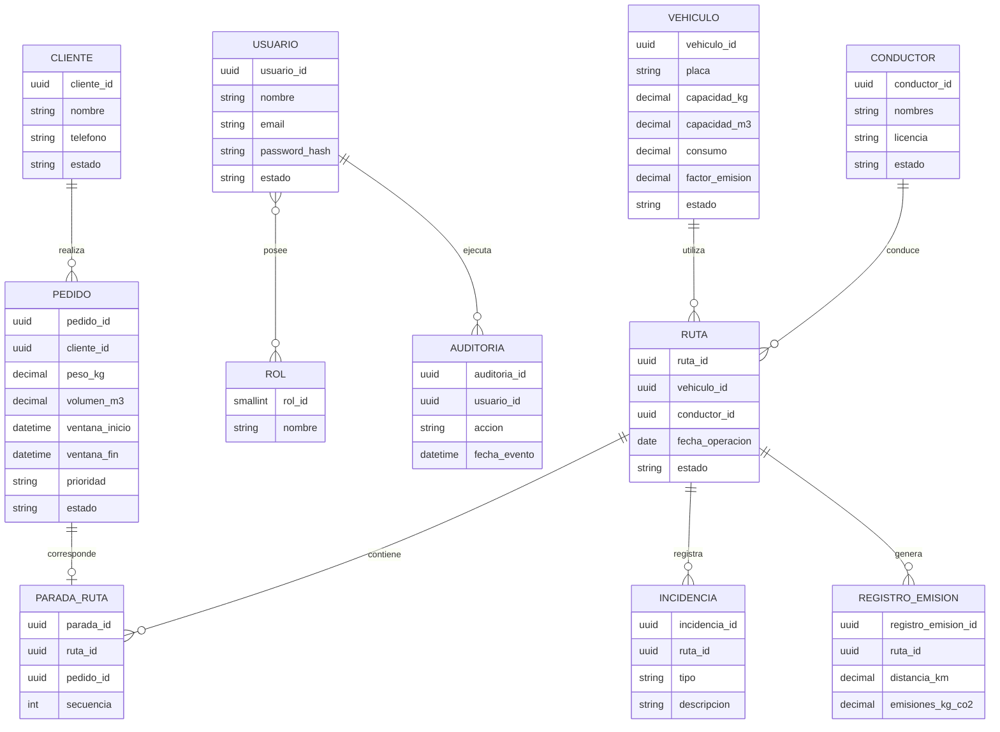

# Base de Datos

| Campo | Detalle |
|---|---|
| **Proyecto** | EcoLogística Lima – Optimizador de Rutas Sostenibles para DistriRápido S.A.C. |
| **Integrantes** | Luis Antony Gonzalo Guerrero, Jhon Robert Paitan Montes, Marco Jhair Martinez Llanos, Rodrigo Vladimir Arce Curi |
| **Fecha** | 01/09/2026 |
| **Versión** | 1.0.0 |

## 1. Objetivo del Documento

Definir el diseño conceptual, lógico y físico de la base de datos de **EcoLogística Lima**, asegurando integridad, trazabilidad, mantenibilidad y soporte para los procesos de gestión de pedidos, flota, conductores, clientes, rutas, incidencias, sostenibilidad y auditoría.

La solución utilizará **PostgreSQL** como sistema gestor de base de datos relacional, conforme al stack tecnológico seleccionado.

---

## 2. Principios de Diseño

El modelo de datos se diseña bajo los siguientes principios:

1. Integridad referencial mediante claves primarias y foráneas.
2. Normalización hasta **Tercera Forma Normal (3FN)**.
3. Evitar duplicidad de información.
4. Mantener trazabilidad de operaciones críticas.
5. Separar catálogos, datos maestros y datos transaccionales.
6. Permitir desactivación lógica cuando sea necesario conservar historial.
7. Utilizar índices sobre columnas de búsqueda, relación y filtrado frecuente.
8. Mantener compatibilidad con futuras extensiones geoespaciales mediante PostGIS.
9. Garantizar consistencia transaccional.
10. Facilitar la relación con requisitos funcionales y reglas de negocio.

---

# 3. Modelo Conceptual

## 3.1. Entidades Principales

Las entidades principales identificadas son:

- Usuario
- Rol
- Vehículo
- Conductor
- Cliente
- Pedido
- Ruta
- Parada de Ruta
- Incidencia
- Registro de Emisiones
- Auditoría

---

## 3.2. Diagrama Entidad-Relación Conceptual



---

# 4. Modelo Lógico

## 4.1. Tabla `usuarios`

| Atributo | Tipo lógico | Restricción |
|---|---|---|
| usuario_id | UUID | PK |
| nombre | VARCHAR(150) | NOT NULL |
| email | VARCHAR(255) | UNIQUE, NOT NULL |
| password_hash | VARCHAR(255) | NOT NULL |
| estado | VARCHAR(20) | NOT NULL |
| creado_en | TIMESTAMP WITH TIME ZONE | NOT NULL |
| actualizado_en | TIMESTAMP WITH TIME ZONE | NOT NULL |

---

## 4.2. Tabla `roles`

| Atributo | Tipo lógico | Restricción |
|---|---|---|
| rol_id | SMALLINT | PK |
| nombre | VARCHAR(50) | UNIQUE, NOT NULL |
| descripcion | VARCHAR(255) | NULL |

---

## 4.3. Tabla `usuario_roles`

Tabla asociativa para resolver la relación muchos-a-muchos entre usuarios y roles.

| Atributo | Tipo lógico | Restricción |
|---|---|---|
| usuario_id | UUID | PK compuesta, FK |
| rol_id | SMALLINT | PK compuesta, FK |
| asignado_en | TIMESTAMP WITH TIME ZONE | NOT NULL |

---

## 4.4. Tabla `vehiculos`

| Atributo | Tipo lógico | Restricción |
|---|---|---|
| vehiculo_id | UUID | PK |
| placa | VARCHAR(15) | UNIQUE, NOT NULL |
| marca | VARCHAR(80) | NOT NULL |
| modelo | VARCHAR(80) | NOT NULL |
| capacidad_kg | NUMERIC(10,2) | NOT NULL |
| capacidad_m3 | NUMERIC(10,2) | NOT NULL |
| consumo_km_l | NUMERIC(10,4) | NULL |
| factor_emision_kg_co2_km | NUMERIC(10,6) | NULL |
| estado | VARCHAR(20) | NOT NULL |
| creado_en | TIMESTAMP WITH TIME ZONE | NOT NULL |
| actualizado_en | TIMESTAMP WITH TIME ZONE | NOT NULL |

---

## 4.5. Tabla `conductores`

| Atributo | Tipo lógico | Restricción |
|---|---|---|
| conductor_id | UUID | PK |
| nombres | VARCHAR(120) | NOT NULL |
| apellidos | VARCHAR(120) | NOT NULL |
| numero_licencia | VARCHAR(30) | UNIQUE, NOT NULL |
| categoria_licencia | VARCHAR(20) | NOT NULL |
| telefono | VARCHAR(30) | NULL |
| experiencia_anios | SMALLINT | NULL |
| estado | VARCHAR(20) | NOT NULL |
| creado_en | TIMESTAMP WITH TIME ZONE | NOT NULL |
| actualizado_en | TIMESTAMP WITH TIME ZONE | NOT NULL |

---

## 4.6. Tabla `clientes`

| Atributo | Tipo lógico | Restricción |
|---|---|---|
| cliente_id | UUID | PK |
| nombre | VARCHAR(180) | NOT NULL |
| telefono | VARCHAR(30) | NULL |
| email | VARCHAR(255) | NULL |
| preferencia_entrega | TEXT | NULL |
| restriccion_acceso | TEXT | NULL |
| estado | VARCHAR(20) | NOT NULL |
| creado_en | TIMESTAMP WITH TIME ZONE | NOT NULL |

---

## 4.7. Tabla `pedidos`

| Atributo | Tipo lógico | Restricción |
|---|---|---|
| pedido_id | UUID | PK |
| cliente_id | UUID | FK, NOT NULL |
| codigo_pedido | VARCHAR(40) | UNIQUE, NOT NULL |
| direccion_entrega | VARCHAR(255) | NOT NULL |
| referencia_entrega | VARCHAR(255) | NULL |
| latitud | NUMERIC(9,6) | NOT NULL |
| longitud | NUMERIC(9,6) | NOT NULL |
| peso_kg | NUMERIC(10,2) | NOT NULL |
| volumen_m3 | NUMERIC(10,3) | NOT NULL |
| ventana_inicio | TIMESTAMP WITH TIME ZONE | NOT NULL |
| ventana_fin | TIMESTAMP WITH TIME ZONE | NOT NULL |
| prioridad | VARCHAR(20) | NOT NULL |
| tipo_producto | VARCHAR(80) | NULL |
| estado | VARCHAR(20) | NOT NULL |
| creado_en | TIMESTAMP WITH TIME ZONE | NOT NULL |
| actualizado_en | TIMESTAMP WITH TIME ZONE | NOT NULL |

---

## 4.8. Tabla `rutas`

| Atributo | Tipo lógico | Restricción |
|---|---|---|
| ruta_id | UUID | PK |
| vehiculo_id | UUID | FK, NOT NULL |
| conductor_id | UUID | FK, NOT NULL |
| fecha_operacion | DATE | NOT NULL |
| hora_inicio_planificada | TIMESTAMP WITH TIME ZONE | NULL |
| hora_fin_planificada | TIMESTAMP WITH TIME ZONE | NULL |
| distancia_total_km | NUMERIC(10,2) | NULL |
| duracion_estimada_min | INTEGER | NULL |
| estado | VARCHAR(20) | NOT NULL |
| tipo_generacion | VARCHAR(20) | NOT NULL |
| creado_en | TIMESTAMP WITH TIME ZONE | NOT NULL |
| actualizado_en | TIMESTAMP WITH TIME ZONE | NOT NULL |

---

## 4.9. Tabla `paradas_ruta`

| Atributo | Tipo lógico | Restricción |
|---|---|---|
| parada_id | UUID | PK |
| ruta_id | UUID | FK, NOT NULL |
| pedido_id | UUID | FK, UNIQUE dentro de ruta |
| secuencia | INTEGER | NOT NULL |
| llegada_estimada | TIMESTAMP WITH TIME ZONE | NULL |
| llegada_real | TIMESTAMP WITH TIME ZONE | NULL |
| estado | VARCHAR(20) | NOT NULL |
| observacion | TEXT | NULL |

---

## 4.10. Tabla `incidencias`

| Atributo | Tipo lógico | Restricción |
|---|---|---|
| incidencia_id | UUID | PK |
| ruta_id | UUID | FK, NOT NULL |
| usuario_reporta_id | UUID | FK, NULL |
| tipo | VARCHAR(50) | NOT NULL |
| descripcion | TEXT | NOT NULL |
| latitud | NUMERIC(9,6) | NULL |
| longitud | NUMERIC(9,6) | NULL |
| estado | VARCHAR(20) | NOT NULL |
| registrada_en | TIMESTAMP WITH TIME ZONE | NOT NULL |
| resuelta_en | TIMESTAMP WITH TIME ZONE | NULL |

---

## 4.11. Tabla `registros_emisiones`

| Atributo | Tipo lógico | Restricción |
|---|---|---|
| registro_emision_id | UUID | PK |
| ruta_id | UUID | FK, NOT NULL |
| distancia_km | NUMERIC(10,2) | NOT NULL |
| consumo_estimado_l | NUMERIC(10,3) | NULL |
| emisiones_kg_co2 | NUMERIC(12,4) | NOT NULL |
| metodo_calculo | VARCHAR(100) | NOT NULL |
| calculado_en | TIMESTAMP WITH TIME ZONE | NOT NULL |

---

## 4.12. Tabla `auditoria`

| Atributo | Tipo lógico | Restricción |
|---|---|---|
| auditoria_id | UUID | PK |
| usuario_id | UUID | FK, NULL |
| entidad | VARCHAR(80) | NOT NULL |
| entidad_id | UUID | NULL |
| accion | VARCHAR(50) | NOT NULL |
| resultado | VARCHAR(20) | NOT NULL |
| detalle | JSONB | NULL |
| fecha_evento | TIMESTAMP WITH TIME ZONE | NOT NULL |

---

# 5. Relaciones Principales

| Entidad Origen | Relación | Entidad Destino | Cardinalidad |
|---|---|---|---|
| Usuario | posee | Rol | N:M |
| Cliente | realiza | Pedido | 1:N |
| Vehículo | ejecuta | Ruta | 1:N |
| Conductor | conduce | Ruta | 1:N |
| Ruta | contiene | Parada | 1:N |
| Pedido | se asigna a | Parada | 1:0..1 por planificación activa |
| Ruta | registra | Incidencia | 1:N |
| Ruta | genera | Registro de Emisiones | 1:N |
| Usuario | ejecuta | Auditoría | 1:N |

---

# 6. Normalización

## 6.1. Primera Forma Normal (1FN)

El modelo cumple 1FN debido a que:

- Cada atributo contiene valores atómicos.
- No existen grupos repetitivos dentro de una misma columna.
- Cada tabla posee una clave primaria.

---

## 6.2. Segunda Forma Normal (2FN)

El modelo cumple 2FN debido a que:

- Todas las tablas se encuentran en 1FN.
- Los atributos no clave dependen de la clave primaria completa.
- La tabla `usuario_roles`, que utiliza clave compuesta, no contiene atributos dependientes de una sola parte de la clave.

---

## 6.3. Tercera Forma Normal (3FN)

El modelo cumple 3FN porque:

- No existen dependencias transitivas entre atributos no clave.
- Los roles se almacenan en una tabla independiente.
- Los datos del cliente no se duplican en `pedidos`.
- Los datos del vehículo y conductor no se duplican en `rutas`.
- Los datos del pedido no se replican dentro de `paradas_ruta`.
- La información de auditoría se mantiene separada de las entidades operativas.

Por lo tanto, el modelo se considera normalizado hasta **3FN**.

---

# 7. Modelo Físico - DDL PostgreSQL

```sql
CREATE EXTENSION IF NOT EXISTS pgcrypto;

-- =========================================================
-- USUARIOS Y ROLES
-- =========================================================

CREATE TABLE roles (
    rol_id SMALLSERIAL PRIMARY KEY,
    nombre VARCHAR(50) NOT NULL UNIQUE,
    descripcion VARCHAR(255)
);

CREATE TABLE usuarios (
    usuario_id UUID PRIMARY KEY DEFAULT gen_random_uuid(),
    nombre VARCHAR(150) NOT NULL,
    email VARCHAR(255) NOT NULL UNIQUE,
    password_hash VARCHAR(255) NOT NULL,
    estado VARCHAR(20) NOT NULL DEFAULT 'ACTIVO'
        CHECK (estado IN ('ACTIVO', 'INACTIVO', 'BLOQUEADO')),
    creado_en TIMESTAMPTZ NOT NULL DEFAULT CURRENT_TIMESTAMP,
    actualizado_en TIMESTAMPTZ NOT NULL DEFAULT CURRENT_TIMESTAMP
);

CREATE TABLE usuario_roles (
    usuario_id UUID NOT NULL,
    rol_id SMALLINT NOT NULL,
    asignado_en TIMESTAMPTZ NOT NULL DEFAULT CURRENT_TIMESTAMP,

    PRIMARY KEY (usuario_id, rol_id),

    CONSTRAINT fk_usuario_roles_usuario
        FOREIGN KEY (usuario_id)
        REFERENCES usuarios(usuario_id),

    CONSTRAINT fk_usuario_roles_rol
        FOREIGN KEY (rol_id)
        REFERENCES roles(rol_id)
);

-- =========================================================
-- VEHÍCULOS
-- =========================================================

CREATE TABLE vehiculos (
    vehiculo_id UUID PRIMARY KEY DEFAULT gen_random_uuid(),
    placa VARCHAR(15) NOT NULL UNIQUE,
    marca VARCHAR(80) NOT NULL,
    modelo VARCHAR(80) NOT NULL,

    capacidad_kg NUMERIC(10,2) NOT NULL
        CHECK (capacidad_kg > 0),

    capacidad_m3 NUMERIC(10,2) NOT NULL
        CHECK (capacidad_m3 > 0),

    consumo_km_l NUMERIC(10,4)
        CHECK (consumo_km_l IS NULL OR consumo_km_l > 0),

    factor_emision_kg_co2_km NUMERIC(10,6)
        CHECK (
            factor_emision_kg_co2_km IS NULL
            OR factor_emision_kg_co2_km >= 0
        ),

    estado VARCHAR(20) NOT NULL DEFAULT 'DISPONIBLE'
        CHECK (
            estado IN (
                'DISPONIBLE',
                'EN_RUTA',
                'MANTENIMIENTO',
                'INACTIVO'
            )
        ),

    creado_en TIMESTAMPTZ NOT NULL DEFAULT CURRENT_TIMESTAMP,
    actualizado_en TIMESTAMPTZ NOT NULL DEFAULT CURRENT_TIMESTAMP
);

-- =========================================================
-- CONDUCTORES
-- =========================================================

CREATE TABLE conductores (
    conductor_id UUID PRIMARY KEY DEFAULT gen_random_uuid(),
    nombres VARCHAR(120) NOT NULL,
    apellidos VARCHAR(120) NOT NULL,
    numero_licencia VARCHAR(30) NOT NULL UNIQUE,
    categoria_licencia VARCHAR(20) NOT NULL,
    telefono VARCHAR(30),

    experiencia_anios SMALLINT
        CHECK (
            experiencia_anios IS NULL
            OR experiencia_anios >= 0
        ),

    estado VARCHAR(20) NOT NULL DEFAULT 'DISPONIBLE'
        CHECK (
            estado IN (
                'DISPONIBLE',
                'ASIGNADO',
                'DESCANSO',
                'INACTIVO'
            )
        ),

    creado_en TIMESTAMPTZ NOT NULL DEFAULT CURRENT_TIMESTAMP,
    actualizado_en TIMESTAMPTZ NOT NULL DEFAULT CURRENT_TIMESTAMP
);

-- =========================================================
-- CLIENTES
-- =========================================================

CREATE TABLE clientes (
    cliente_id UUID PRIMARY KEY DEFAULT gen_random_uuid(),
    nombre VARCHAR(180) NOT NULL,
    telefono VARCHAR(30),
    email VARCHAR(255),
    preferencia_entrega TEXT,
    restriccion_acceso TEXT,

    estado VARCHAR(20) NOT NULL DEFAULT 'ACTIVO'
        CHECK (estado IN ('ACTIVO', 'INACTIVO')),

    creado_en TIMESTAMPTZ NOT NULL DEFAULT CURRENT_TIMESTAMP
);

-- =========================================================
-- PEDIDOS
-- =========================================================

CREATE TABLE pedidos (
    pedido_id UUID PRIMARY KEY DEFAULT gen_random_uuid(),
    cliente_id UUID NOT NULL,
    codigo_pedido VARCHAR(40) NOT NULL UNIQUE,
    direccion_entrega VARCHAR(255) NOT NULL,
    referencia_entrega VARCHAR(255),

    latitud NUMERIC(9,6) NOT NULL
        CHECK (latitud BETWEEN -90 AND 90),

    longitud NUMERIC(9,6) NOT NULL
        CHECK (longitud BETWEEN -180 AND 180),

    peso_kg NUMERIC(10,2) NOT NULL
        CHECK (peso_kg > 0),

    volumen_m3 NUMERIC(10,3) NOT NULL
        CHECK (volumen_m3 > 0),

    ventana_inicio TIMESTAMPTZ NOT NULL,
    ventana_fin TIMESTAMPTZ NOT NULL,

    prioridad VARCHAR(20) NOT NULL DEFAULT 'MEDIA'
        CHECK (prioridad IN ('ALTA', 'MEDIA', 'BAJA')),

    tipo_producto VARCHAR(80),

    estado VARCHAR(20) NOT NULL DEFAULT 'PENDIENTE'
        CHECK (
            estado IN (
                'PENDIENTE',
                'PLANIFICADO',
                'EN_RUTA',
                'ENTREGADO',
                'CANCELADO',
                'NO_ASIGNADO'
            )
        ),

    creado_en TIMESTAMPTZ NOT NULL DEFAULT CURRENT_TIMESTAMP,
    actualizado_en TIMESTAMPTZ NOT NULL DEFAULT CURRENT_TIMESTAMP,

    CONSTRAINT fk_pedidos_cliente
        FOREIGN KEY (cliente_id)
        REFERENCES clientes(cliente_id),

    CONSTRAINT ck_pedidos_ventana
        CHECK (ventana_inicio < ventana_fin)
);

-- =========================================================
-- RUTAS
-- =========================================================

CREATE TABLE rutas (
    ruta_id UUID PRIMARY KEY DEFAULT gen_random_uuid(),
    vehiculo_id UUID NOT NULL,
    conductor_id UUID NOT NULL,
    fecha_operacion DATE NOT NULL,

    hora_inicio_planificada TIMESTAMPTZ,
    hora_fin_planificada TIMESTAMPTZ,

    distancia_total_km NUMERIC(10,2)
        CHECK (
            distancia_total_km IS NULL
            OR distancia_total_km >= 0
        ),

    duracion_estimada_min INTEGER
        CHECK (
            duracion_estimada_min IS NULL
            OR duracion_estimada_min >= 0
        ),

    estado VARCHAR(20) NOT NULL DEFAULT 'PLANIFICADA'
        CHECK (
            estado IN (
                'PLANIFICADA',
                'ACTIVA',
                'FINALIZADA',
                'CANCELADA',
                'REOPTIMIZADA'
            )
        ),

    tipo_generacion VARCHAR(20) NOT NULL DEFAULT 'INICIAL'
        CHECK (
            tipo_generacion IN (
                'INICIAL',
                'REOPTIMIZACION'
            )
        ),

    creado_en TIMESTAMPTZ NOT NULL DEFAULT CURRENT_TIMESTAMP,
    actualizado_en TIMESTAMPTZ NOT NULL DEFAULT CURRENT_TIMESTAMP,

    CONSTRAINT fk_rutas_vehiculo
        FOREIGN KEY (vehiculo_id)
        REFERENCES vehiculos(vehiculo_id),

    CONSTRAINT fk_rutas_conductor
        FOREIGN KEY (conductor_id)
        REFERENCES conductores(conductor_id),

    CONSTRAINT ck_rutas_horario
        CHECK (
            hora_inicio_planificada IS NULL
            OR hora_fin_planificada IS NULL
            OR hora_inicio_planificada < hora_fin_planificada
        )
);

-- =========================================================
-- PARADAS DE RUTA
-- =========================================================

CREATE TABLE paradas_ruta (
    parada_id UUID PRIMARY KEY DEFAULT gen_random_uuid(),
    ruta_id UUID NOT NULL,
    pedido_id UUID NOT NULL,
    secuencia INTEGER NOT NULL
        CHECK (secuencia > 0),

    llegada_estimada TIMESTAMPTZ,
    llegada_real TIMESTAMPTZ,

    estado VARCHAR(20) NOT NULL DEFAULT 'PENDIENTE'
        CHECK (
            estado IN (
                'PENDIENTE',
                'EN_PROCESO',
                'ENTREGADO',
                'NO_ENTREGADO',
                'CANCELADO'
            )
        ),

    observacion TEXT,

    CONSTRAINT fk_paradas_ruta
        FOREIGN KEY (ruta_id)
        REFERENCES rutas(ruta_id)
        ON DELETE CASCADE,

    CONSTRAINT fk_paradas_pedido
        FOREIGN KEY (pedido_id)
        REFERENCES pedidos(pedido_id),

    CONSTRAINT uq_ruta_secuencia
        UNIQUE (ruta_id, secuencia),

    CONSTRAINT uq_ruta_pedido
        UNIQUE (ruta_id, pedido_id)
);

-- =========================================================
-- INCIDENCIAS
-- =========================================================

CREATE TABLE incidencias (
    incidencia_id UUID PRIMARY KEY DEFAULT gen_random_uuid(),
    ruta_id UUID NOT NULL,
    usuario_reporta_id UUID,

    tipo VARCHAR(50) NOT NULL
        CHECK (
            tipo IN (
                'ACCIDENTE',
                'AVERIA',
                'TRAFICO',
                'BLOQUEO_VIAL',
                'NUEVO_PEDIDO',
                'CANCELACION',
                'OTRO'
            )
        ),

    descripcion TEXT NOT NULL,

    latitud NUMERIC(9,6)
        CHECK (
            latitud IS NULL
            OR latitud BETWEEN -90 AND 90
        ),

    longitud NUMERIC(9,6)
        CHECK (
            longitud IS NULL
            OR longitud BETWEEN -180 AND 180
        ),

    estado VARCHAR(20) NOT NULL DEFAULT 'ABIERTA'
        CHECK (estado IN ('ABIERTA', 'EN_REVISION', 'RESUELTA')),

    registrada_en TIMESTAMPTZ NOT NULL DEFAULT CURRENT_TIMESTAMP,
    resuelta_en TIMESTAMPTZ,

    CONSTRAINT fk_incidencias_ruta
        FOREIGN KEY (ruta_id)
        REFERENCES rutas(ruta_id),

    CONSTRAINT fk_incidencias_usuario
        FOREIGN KEY (usuario_reporta_id)
        REFERENCES usuarios(usuario_id)
);

-- =========================================================
-- EMISIONES
-- =========================================================

CREATE TABLE registros_emisiones (
    registro_emision_id UUID PRIMARY KEY DEFAULT gen_random_uuid(),
    ruta_id UUID NOT NULL,

    distancia_km NUMERIC(10,2) NOT NULL
        CHECK (distancia_km >= 0),

    consumo_estimado_l NUMERIC(10,3)
        CHECK (
            consumo_estimado_l IS NULL
            OR consumo_estimado_l >= 0
        ),

    emisiones_kg_co2 NUMERIC(12,4) NOT NULL
        CHECK (emisiones_kg_co2 >= 0),

    metodo_calculo VARCHAR(100) NOT NULL,

    calculado_en TIMESTAMPTZ NOT NULL DEFAULT CURRENT_TIMESTAMP,

    CONSTRAINT fk_emisiones_ruta
        FOREIGN KEY (ruta_id)
        REFERENCES rutas(ruta_id)
);

-- =========================================================
-- AUDITORÍA
-- =========================================================

CREATE TABLE auditoria (
    auditoria_id UUID PRIMARY KEY DEFAULT gen_random_uuid(),
    usuario_id UUID,

    entidad VARCHAR(80) NOT NULL,
    entidad_id UUID,
    accion VARCHAR(50) NOT NULL,

    resultado VARCHAR(20) NOT NULL
        CHECK (resultado IN ('EXITOSO', 'FALLIDO')),

    detalle JSONB,

    fecha_evento TIMESTAMPTZ NOT NULL DEFAULT CURRENT_TIMESTAMP,

    CONSTRAINT fk_auditoria_usuario
        FOREIGN KEY (usuario_id)
        REFERENCES usuarios(usuario_id)
);

-- =========================================================
-- ÍNDICES
-- =========================================================

CREATE INDEX idx_usuarios_email
    ON usuarios(email);

CREATE INDEX idx_usuarios_estado
    ON usuarios(estado);

CREATE INDEX idx_vehiculos_estado
    ON vehiculos(estado);

CREATE INDEX idx_conductores_estado
    ON conductores(estado);

CREATE INDEX idx_clientes_estado
    ON clientes(estado);

CREATE INDEX idx_pedidos_cliente
    ON pedidos(cliente_id);

CREATE INDEX idx_pedidos_estado
    ON pedidos(estado);

CREATE INDEX idx_pedidos_prioridad
    ON pedidos(prioridad);

CREATE INDEX idx_pedidos_ventana
    ON pedidos(ventana_inicio, ventana_fin);

CREATE INDEX idx_pedidos_coordenadas
    ON pedidos(latitud, longitud);

CREATE INDEX idx_rutas_fecha
    ON rutas(fecha_operacion);

CREATE INDEX idx_rutas_estado
    ON rutas(estado);

CREATE INDEX idx_rutas_vehiculo
    ON rutas(vehiculo_id);

CREATE INDEX idx_rutas_conductor
    ON rutas(conductor_id);

CREATE INDEX idx_paradas_ruta
    ON paradas_ruta(ruta_id);

CREATE INDEX idx_paradas_pedido
    ON paradas_ruta(pedido_id);

CREATE INDEX idx_incidencias_ruta
    ON incidencias(ruta_id);

CREATE INDEX idx_incidencias_estado
    ON incidencias(estado);

CREATE INDEX idx_emisiones_ruta
    ON registros_emisiones(ruta_id);

CREATE INDEX idx_auditoria_usuario
    ON auditoria(usuario_id);

CREATE INDEX idx_auditoria_entidad
    ON auditoria(entidad, entidad_id);

CREATE INDEX idx_auditoria_fecha
    ON auditoria(fecha_evento);

CREATE INDEX idx_auditoria_detalle_gin
    ON auditoria USING GIN(detalle);
```

---

# 8. Datos Iniciales de Roles

```sql
INSERT INTO roles (nombre, descripcion) VALUES
('ADMINISTRADOR', 'Administración general del sistema'),
('OPERADOR_LOGISTICO', 'Gestión operativa de pedidos, flota y rutas'),
('SUPERVISOR', 'Supervisión y validación operativa'),
('CONDUCTOR', 'Consulta y ejecución de rutas asignadas'),
('GERENCIA', 'Consulta de indicadores y reportes'),
('AUDITOR', 'Consulta de trazabilidad y auditoría');
```

---

# 9. Reglas de Integridad Cubiertas por el Modelo

| Regla | Implementación |
|---|---|
| Usuario debe poseer email único | `UNIQUE` en `usuarios.email` |
| Vehículo debe poseer placa única | `UNIQUE` en `vehiculos.placa` |
| Conductor debe poseer licencia única | `UNIQUE` en `conductores.numero_licencia` |
| Ventana inicio debe ser menor que ventana fin | `CHECK` en `pedidos` |
| Peso debe ser positivo | `CHECK` en `pedidos.peso_kg` |
| Volumen debe ser positivo | `CHECK` en `pedidos.volumen_m3` |
| Coordenadas deben encontrarse en rangos válidos | `CHECK` en latitud y longitud |
| Secuencia de parada no debe repetirse dentro de una ruta | `UNIQUE (ruta_id, secuencia)` |
| Un pedido no puede repetirse dentro de una misma ruta | `UNIQUE (ruta_id, pedido_id)` |
| Emisiones no pueden ser negativas | `CHECK` |
| Operaciones de auditoría deben registrar resultado | `NOT NULL + CHECK` |

---

# 10. Reglas que Requieren Lógica de Aplicación

Algunas reglas de negocio no deben resolverse exclusivamente mediante restricciones de base de datos.

Estas deben validarse en la capa de servicios del backend:

- RN-005: Capacidad total del vehículo.
- RN-006: Disponibilidad del vehículo.
- RN-007: Disponibilidad del conductor.
- RN-008: Solapamiento de asignaciones del conductor.
- RN-010: Cumplimiento de ventanas de tiempo.
- RN-011: Prioridad de pedidos.
- RN-013: Re-optimización ante incidencias.
- RN-014: Conservación de asignaciones válidas.
- RN-015: Identificación de pedidos no asignables.
- RN-023: Restricciones de seguridad vial.
- RN-024: Restricciones de infraestructura vial.
- RN-025: Preferencias de cliente.
- RN-026: Restricciones de acceso.
- RN-027: Uso de datos vigentes.

La base de datos garantiza integridad estructural, mientras que las reglas operativas complejas serán implementadas en el dominio de la aplicación.

---

# 11. Estrategia de Índices

Los índices se concentran en columnas utilizadas con frecuencia para:

- Buscar usuarios por email.
- Filtrar pedidos por estado.
- Buscar pedidos por cliente.
- Filtrar por prioridad.
- Consultar ventanas de entrega.
- Obtener rutas por fecha.
- Consultar rutas por vehículo o conductor.
- Consultar incidencias activas.
- Consultar emisiones de una ruta.
- Consultar auditoría por usuario, entidad o fecha.

No se crearán índices innecesarios sobre todas las columnas debido a que cada índice incrementa el costo de escritura y almacenamiento.

---

# 12. Consideraciones Geoespaciales

La versión inicial almacena coordenadas mediante columnas:

- `latitud`
- `longitud`

Si el proyecto requiere consultas geográficas avanzadas, podrá habilitarse **PostGIS**.

Ejemplo de extensión futura:

```sql
CREATE EXTENSION IF NOT EXISTS postgis;
```

Posteriormente podrían incorporarse columnas de tipo:

```sql
GEOGRAPHY(Point, 4326)
```

Esto permitiría optimizar operaciones como:

- Búsqueda por proximidad.
- Cálculo de distancias.
- Índices espaciales.
- Agrupación geográfica.
- Validación de puntos.

La incorporación de PostGIS deberá justificarse según las necesidades reales del MVP.

---

# 13. Consideraciones de Seguridad

La base de datos deberá cumplir las siguientes prácticas:

1. No almacenar contraseñas en texto plano.
2. Mantener únicamente `password_hash`.
3. No exponer credenciales de conexión en el repositorio.
4. Utilizar variables de entorno.
5. Aplicar principio de mínimo privilegio.
6. Separar usuarios técnicos de base de datos según entorno.
7. Utilizar conexiones cifradas en producción.
8. Registrar operaciones críticas mediante auditoría.
9. Mantener copias de seguridad.
10. Limitar el acceso directo a producción.

---

# 14. Estrategia de Auditoría

La tabla `auditoria` permitirá registrar:

- Usuario responsable.
- Entidad afectada.
- Identificador del registro.
- Acción realizada.
- Resultado.
- Detalle adicional.
- Fecha y hora.

Ejemplo:

```sql
INSERT INTO auditoria (
    usuario_id,
    entidad,
    entidad_id,
    accion,
    resultado,
    detalle
)
VALUES (
    '00000000-0000-0000-0000-000000000001',
    'PEDIDO',
    '00000000-0000-0000-0000-000000000002',
    'ACTUALIZAR',
    'EXITOSO',
    '{"campo":"estado","anterior":"PENDIENTE","nuevo":"PLANIFICADO"}'
);
```

---

# 15. Relación con Requisitos Funcionales

| Requisito Funcional | Tablas Principales |
|---|---|
| RF-001 Gestión de Flota | `vehiculos` |
| RF-002 Gestión de Pedidos | `pedidos`, `clientes` |
| RF-003 Generación de Rutas | `rutas`, `paradas_ruta`, `vehiculos`, `conductores`, `pedidos` |
| RF-004 Visualización de Rutas | `rutas`, `paradas_ruta`, `pedidos` |
| RF-005 Dashboard | `rutas`, `pedidos`, `registros_emisiones`, `incidencias` |
| RF-006 Reportes de Sostenibilidad | `registros_emisiones`, `rutas` |
| RF-007 Re-optimización | `rutas`, `paradas_ruta`, `incidencias`, `pedidos` |
| RF-008 Gestión de Conductores | `conductores` |
| RF-009 Gestión de Clientes | `clientes`, `pedidos` |
| RF-010 Seguimiento de Emisiones | `registros_emisiones`, `rutas`, `vehiculos` |

---

# 16. Relación con Requisitos No Funcionales

| RNF | Soporte del Modelo |
|---|---|
| RNF-004 Escalabilidad | Índices, normalización y claves eficientes |
| RNF-005 Seguridad | Separación de credenciales y roles |
| RNF-007 Control de Acceso | `usuarios`, `roles`, `usuario_roles` |
| RNF-010 Integridad | PK, FK, UNIQUE, CHECK y transacciones |
| RNF-011 Auditoría | Tabla `auditoria` |
| RNF-012 Recuperación | Compatibilidad con backups y recuperación PostgreSQL |
| RNF-013 Rendimiento | Índices sobre consultas frecuentes |
| RNF-017 Consumo de Recursos | Índices controlados y consultas optimizables |

---

# 17. Estrategia de Respaldo y Recuperación

Para el entorno de producción se deberá contemplar:

- Copias de seguridad periódicas.
- Verificación de restauración.
- Control de acceso a respaldos.
- Conservación según política definida.
- Automatización cuando la infraestructura lo permita.

Durante el MVP académico, se deberá garantizar como mínimo la posibilidad de exportar y restaurar la base de datos de manera reproducible.

Ejemplo:

```bash
pg_dump -Fc ecologistica_lima > ecologistica_lima.backup
```

Restauración:

```bash
pg_restore -d ecologistica_lima ecologistica_lima.backup
```

---

# 18. Evolución del Modelo

El modelo podrá evolucionar cuando se incorporen nuevas necesidades, por ejemplo:

- Catálogo de tipos de vehículo.
- Historial de mantenimiento.
- Disponibilidad por franjas horarias.
- Planes de compensación de carbono.
- Datos históricos de tráfico.
- Alertas.
- Notificaciones.
- Geometrías PostGIS.
- Historial detallado de cambios de ruta.

Cualquier modificación estructural deberá:

1. Ser documentada.
2. Mantener trazabilidad con RF y reglas de negocio.
3. Implementarse mediante migraciones.
4. Evitar pérdida de información.
5. Incrementar la versión del documento cuando corresponda.

---

# 19. Conclusión

El diseño propuesto proporciona una base relacional consistente para EcoLogística Lima y cubre las principales necesidades funcionales definidas en el proyecto.

La arquitectura de datos:

- Mantiene normalización hasta 3FN.
- Separa correctamente entidades maestras y transaccionales.
- Incluye trazabilidad mediante auditoría.
- Incorpora restricciones de integridad.
- Considera rendimiento mediante índices.
- Mantiene compatibilidad con PostgreSQL y una futura extensión PostGIS.
- Proporciona una base adecuada para la implementación del backend con FastAPI.

Este modelo será utilizado como referencia para el diseño arquitectónico desarrollado posteriormente en el documento **12. Modelo C4 V_1_0_0.md**.
