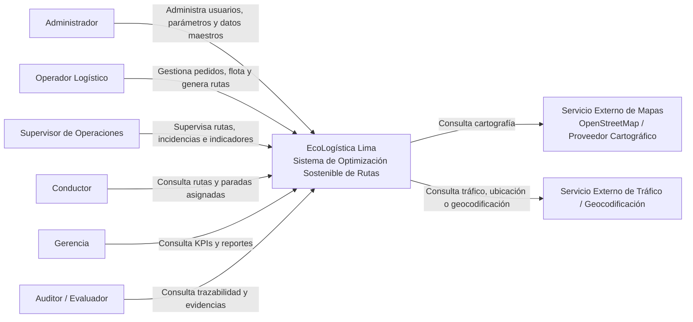
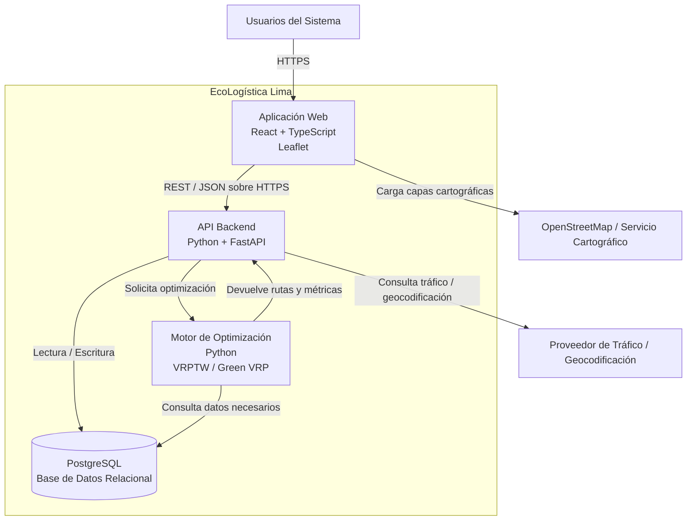
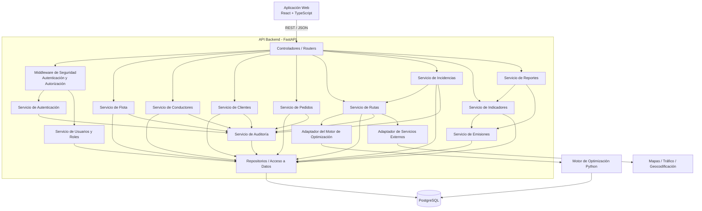
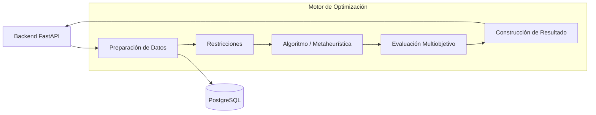
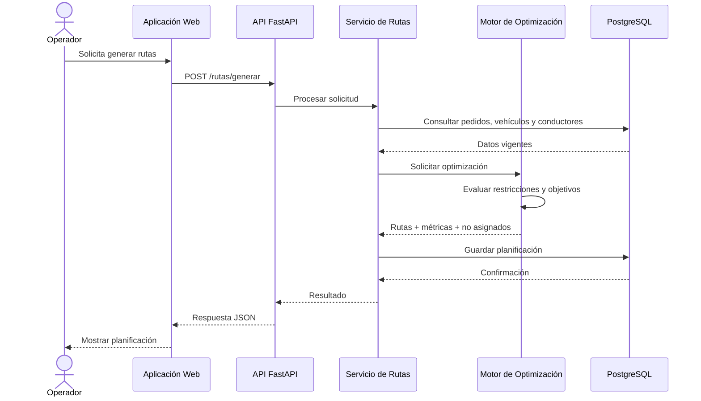
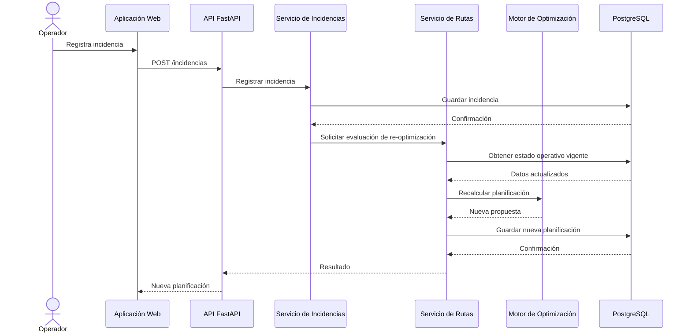

# Modelo C4

| Campo | Detalle |
|---|---|
| **Proyecto** | EcoLogística Lima – Optimizador de Rutas Sostenibles para DistriRápido S.A.C. |
| **Integrantes** | Luis Antony Gonzalo Guerrero, Jhon Robert Paitan Montes, Marco Jhair Martinez Llanos, Rodrigo Vladimir Arce Curi |
| **Fecha** | 01/09/2026 |
| **Versión** | 1.0.0 |

## 1. Objetivo del Documento

Definir la arquitectura de software de **EcoLogística Lima** mediante el modelo **C4**, representando progresivamente el sistema desde su contexto general hasta la estructura interna de sus principales componentes.

El documento incluye:

1. **Nivel 1 – Contexto:** actores y sistemas externos que interactúan con EcoLogística Lima.
2. **Nivel 2 – Contenedores:** principales unidades ejecutables y de almacenamiento.
3. **Nivel 3 – Componentes:** organización interna del backend y sus responsabilidades.

La arquitectura se alinea con el stack tecnológico seleccionado:

- **Frontend:** React + TypeScript
- **Backend:** Python + FastAPI
- **Base de datos:** PostgreSQL
- **Mapas:** Leaflet + OpenStreetMap
- **Motor de optimización:** Python
- **Comunicación:** REST / JSON sobre HTTPS

---

# 2. Principios Arquitectónicos

La arquitectura de EcoLogística Lima se diseña bajo los siguientes principios:

1. Separación de responsabilidades.
2. Bajo acoplamiento entre componentes.
3. Alta cohesión dentro de cada módulo.
4. Separación entre interfaz, lógica de negocio y persistencia.
5. Motor de optimización desacoplado del frontend.
6. Seguridad aplicada en cada operación protegida.
7. Persistencia relacional con integridad referencial.
8. Trazabilidad de operaciones críticas.
9. Posibilidad de escalar componentes de forma independiente.
10. Integración controlada con servicios externos.

---

# 3. Nivel 1 – Diagrama de Contexto

## 3.1. Descripción

El diagrama de contexto representa EcoLogística Lima como un único sistema y muestra sus principales usuarios, actores y servicios externos.

Los actores principales son:

- Administrador.
- Operador Logístico.
- Supervisor.
- Conductor.
- Gerencia.
- Auditor.

Los sistemas externos principales son:

- Servicios de mapas y cartografía.
- Servicios de tráfico o geocodificación.

---

## 3.2. Diagrama de Contexto

---

## 3.3. Descripción de Interacciones

| Actor / Sistema | Interacción con EcoLogística Lima |
|---|---|
| Administrador | Gestiona usuarios, roles, parámetros y catálogos |
| Operador Logístico | Gestiona pedidos, flota, conductores, rutas e incidencias |
| Supervisor | Revisa planificaciones, indicadores y excepciones |
| Conductor | Consulta únicamente las rutas y pedidos asignados |
| Gerencia | Consulta dashboard, ahorro, costos y sostenibilidad |
| Auditor | Consulta registros y trazabilidad en modo lectura |
| Servicio de Mapas | Proporciona información cartográfica |
| Servicio de Tráfico | Proporciona datos externos para apoyar planificación y re-optimización |

---

# 4. Nivel 2 – Diagrama de Contenedores

## 4.1. Descripción

EcoLogística Lima se divide en los siguientes contenedores principales:

### Aplicación Web

Responsable de presentar la interfaz de usuario.

Tecnologías:

- React
- TypeScript
- Leaflet

### API Backend

Responsable de:

- Autenticación.
- Autorización.
- Reglas de negocio.
- Gestión de pedidos.
- Gestión de flota.
- Gestión de conductores.
- Gestión de clientes.
- Dashboard.
- Auditoría.
- Integraciones externas.

Tecnología:

- Python
- FastAPI

### Motor de Optimización

Responsable de:

- Generación de rutas.
- VRPTW.
- Green VRP.
- Re-optimización.
- Evaluación de restricciones.
- Cálculo de objetivos.

Tecnología:

- Python

### Base de Datos

Responsable de almacenar los datos transaccionales y maestros.

Tecnología:

- PostgreSQL

---

## 4.2. Diagrama de Contenedores

---

# 5. Responsabilidades por Contenedor

| Contenedor | Responsabilidad Principal |
|---|---|
| Aplicación Web | Interacción con usuarios |
| API Backend | Lógica de aplicación y coordinación |
| Motor de Optimización | Cálculo y re-optimización de rutas |
| PostgreSQL | Persistencia y consistencia de datos |
| Servicio de Mapas | Información cartográfica |
| Servicio de Tráfico | Información externa dinámica |

---

# 6. Comunicación entre Contenedores

| Origen | Destino | Protocolo / Formato | Propósito |
|---|---|---|---|
| Navegador | Frontend | HTTPS | Acceso al sistema |
| Frontend | Backend | REST / JSON sobre HTTPS | Operaciones de negocio |
| Backend | Motor de Optimización | Interfaz interna / llamada de servicio | Generar o recalcular rutas |
| Backend | PostgreSQL | PostgreSQL Protocol | Lectura y escritura |
| Motor de Optimización | PostgreSQL | PostgreSQL Protocol | Lectura de datos necesarios |
| Frontend | OpenStreetMap | HTTPS | Capas cartográficas |
| Backend | Servicio de Tráfico | HTTPS / API | Información dinámica |

---

# 7. Nivel 3 – Diagrama de Componentes del Backend

## 7.1. Descripción

El backend será organizado mediante componentes especializados.

Los principales componentes son:

- API Controllers.
- Middleware de Seguridad.
- Servicio de Autenticación.
- Servicio de Usuarios.
- Servicio de Flota.
- Servicio de Conductores.
- Servicio de Clientes.
- Servicio de Pedidos.
- Servicio de Rutas.
- Servicio de Incidencias.
- Servicio de Indicadores.
- Servicio de Emisiones.
- Servicio de Reportes.
- Servicio de Auditoría.
- Adaptador de Mapas / Tráfico.
- Adaptador del Motor de Optimización.
- Repositorios.
- Base de datos.

---

## 7.2. Diagrama de Componentes

---

# 8. Componentes del Backend

## 8.1. Controladores / Routers

Responsabilidades:

- Recibir solicitudes HTTP.
- Validar estructura básica de entrada.
- Delegar procesamiento a servicios.
- Retornar respuestas HTTP.

No deben contener lógica compleja de negocio.

---

## 8.2. Middleware de Seguridad

Responsabilidades:

- Validar autenticación.
- Validar autorización.
- Verificar estado del usuario.
- Aplicar controles de acceso.
- Rechazar solicitudes no autorizadas.

Se relaciona principalmente con:

- RNF-005.
- RNF-006.
- RNF-007.
- RN-001.
- RN-002.
- RN-003.

---

## 8.3. Servicio de Autenticación

Responsabilidades:

- Validación de credenciales.
- Inicio de sesión.
- Gestión de identidad autenticada.
- Coordinación con autorización.

---

## 8.4. Servicio de Usuarios y Roles

Responsabilidades:

- Gestión de usuarios.
- Gestión de roles.
- Asignación de permisos.
- Activación o desactivación de usuarios.

---

## 8.5. Servicio de Flota

Responsabilidades:

- Registrar vehículos.
- Actualizar vehículos.
- Consultar disponibilidad.
- Validar datos vehiculares.

Relacionado con:

- RF-001.
- RN-005.
- RN-006.

---

## 8.6. Servicio de Conductores

Responsabilidades:

- Registrar conductores.
- Actualizar disponibilidad.
- Validar licencias y estado.
- Proporcionar información para planificación.

Relacionado con:

- RF-008.
- RN-007.
- RN-008.

---

## 8.7. Servicio de Clientes

Responsabilidades:

- Gestionar clientes.
- Gestionar preferencias.
- Gestionar restricciones de acceso.

Relacionado con:

- RF-009.
- RN-025.
- RN-026.

---

## 8.8. Servicio de Pedidos

Responsabilidades:

- Registrar pedidos.
- Modificar pedidos.
- Cancelar pedidos.
- Validar ventanas de tiempo.
- Gestionar prioridad.
- Proporcionar pedidos al motor de planificación.

Relacionado con:

- RF-002.
- RN-009.
- RN-010.
- RN-011.
- RN-012.

---

## 8.9. Servicio de Rutas

Responsabilidades:

- Solicitar generación de rutas.
- Consultar rutas.
- Gestionar estados.
- Coordinar re-optimización.
- Evaluar pedidos no asignables.
- Coordinar con servicios externos.

Relacionado con:

- RF-003.
- RF-004.
- RF-007.

---

## 8.10. Servicio de Incidencias

Responsabilidades:

- Registrar incidentes.
- Consultar incidencias.
- Gestionar cambios de estado.
- Activar procesos de re-optimización cuando corresponda.

Relacionado con:

- RF-007.
- RN-013.

---

## 8.11. Servicio de Indicadores

Responsabilidades:

- Calcular métricas operativas.
- Consolidar datos para dashboard.
- Comparar resultados con líneas base.

Relacionado con:

- RF-005.
- RN-017.
- RN-018.

---

## 8.12. Servicio de Emisiones

Responsabilidades:

- Calcular emisiones.
- Registrar resultados.
- Validar disponibilidad de datos.
- Proporcionar información ambiental.

Relacionado con:

- RF-010.
- RN-016.
- RN-018.

---

## 8.13. Servicio de Reportes

Responsabilidades:

- Generar reportes.
- Consolidar indicadores.
- Preparar información de sostenibilidad.

Relacionado con:

- RF-006.

---

## 8.14. Servicio de Auditoría

Responsabilidades:

- Registrar operaciones críticas.
- Identificar usuario, acción y resultado.
- Mantener trazabilidad.

Relacionado con:

- RNF-011.
- RN-019.
- RN-020.

---

## 8.15. Adaptador del Motor de Optimización

Responsabilidades:

- Preparar datos de entrada.
- Invocar al motor de optimización.
- Recibir resultados.
- Traducir resultados hacia estructuras del dominio.

El adaptador evita que la API dependa directamente de la implementación interna del algoritmo.

---

## 8.16. Adaptador de Servicios Externos

Responsabilidades:

- Consultar mapas.
- Consultar geocodificación.
- Consultar tráfico.
- Gestionar errores externos.
- Aislar dependencias con proveedores.

Relacionado con:

- RN-022.

---

## 8.17. Repositorios

Responsabilidades:

- Acceso a persistencia.
- Consultas.
- Altas.
- Actualizaciones.
- Operaciones transaccionales.

Los servicios no deben acceder directamente a PostgreSQL sin pasar por la capa de repositorios.

---

# 9. Arquitectura del Motor de Optimización

El motor de optimización se mantiene como componente especializado debido a su carga computacional y a la necesidad de evolucionar de forma independiente.

---

# 10. Responsabilidades del Motor de Optimización

## Preparación de Datos

Transforma pedidos, vehículos, conductores y restricciones en estructuras aptas para procesamiento.

## Restricciones

Considera:

- Capacidad.
- Disponibilidad.
- Ventanas de tiempo.
- Seguridad vial.
- Restricciones de acceso.
- Prioridad.
- Infraestructura vial.

## Algoritmo / Metaheurística

Busca soluciones factibles para el problema de distribución.

## Evaluación Multiobjetivo

Evalúa criterios como:

- Distancia.
- Tiempo.
- Consumo.
- Emisiones.
- Penalizaciones.
- Cumplimiento.

## Construcción de Resultado

Genera:

- Rutas.
- Secuencia de paradas.
- Pedidos no asignados.
- Métricas.

---

# 11. Flujo de Generación de Rutas

---

# 12. Flujo de Re-optimización

---

# 13. Seguridad Arquitectónica

La seguridad se aplica en diferentes niveles.

## Frontend

- No confiar en validaciones exclusivas del cliente.
- Ocultar capacidades no autorizadas únicamente como apoyo de UX.
- No almacenar secretos del backend.

## Backend

- Validar autenticación.
- Validar autorización.
- Validar entradas.
- Aplicar reglas de negocio.
- Registrar operaciones críticas.

## Base de Datos

- Integridad referencial.
- Usuarios de base de datos con privilegios limitados.
- Credenciales fuera del código.
- Conexiones seguras en producción.

## Comunicación

- HTTPS/TLS para tráfico externo.

---

# 14. Escalabilidad

La arquitectura permite crecimiento progresivo mediante:

- Separación frontend/backend.
- Backend sin estado cuando sea posible.
- Motor de optimización desacoplado.
- Base de datos centralizada.
- Uso de índices.
- Contenedores.
- Posibilidad de replicar instancias del backend.
- Posibilidad futura de ejecutar el motor de optimización como servicio independiente.

El objetivo de diseño es soportar:

- Hasta 1,000 pedidos diarios.
- Hasta 50 vehículos.

---

# 15. Disponibilidad y Tolerancia a Fallos

La arquitectura deberá considerar que los servicios externos pueden fallar.

Principios:

1. Una caída del proveedor de mapas no debe eliminar una planificación ya generada.
2. Una caída del servicio de tráfico debe permitir trabajar con la información disponible.
3. Los errores externos deben registrarse.
4. Las operaciones críticas deben mantener consistencia.
5. Los fallos parciales no deben confirmar transacciones incompletas.

---

# 16. Relación con Requisitos Funcionales

| RF | Componentes Principales |
|---|---|
| RF-001 Gestión de Flota | Servicio de Flota, Repositorios |
| RF-002 Gestión de Pedidos | Servicio de Pedidos, Servicio de Clientes |
| RF-003 Generación de Rutas | Servicio de Rutas, Motor de Optimización |
| RF-004 Visualización de Rutas | Frontend, Servicio de Rutas, Mapas |
| RF-005 Dashboard | Servicio de Indicadores |
| RF-006 Reportes | Servicio de Reportes, Indicadores, Emisiones |
| RF-007 Re-optimización | Incidencias, Servicio de Rutas, Motor |
| RF-008 Conductores | Servicio de Conductores |
| RF-009 Clientes | Servicio de Clientes |
| RF-010 Emisiones | Servicio de Emisiones |

---

# 17. Relación con Requisitos No Funcionales

| RNF | Decisión Arquitectónica |
|---|---|
| RNF-001 Rendimiento de generación | Motor de optimización especializado |
| RNF-002 Re-optimización | Motor desacoplado y servicio de rutas |
| RNF-003 Disponibilidad | Separación de responsabilidades y manejo de fallos externos |
| RNF-004 Escalabilidad | Contenedores independientes |
| RNF-005 Seguridad | Middleware y servicios de seguridad |
| RNF-006 TLS | Comunicación HTTPS |
| RNF-007 Control de acceso | Middleware de autorización |
| RNF-008 Accesibilidad | Frontend desacoplado |
| RNF-010 Integridad | PostgreSQL + servicios transaccionales |
| RNF-011 Auditoría | Servicio específico de auditoría |
| RNF-012 Recuperación | Persistencia centralizada y despliegue reproducible |
| RNF-013 Tiempo de respuesta | API separada de procesos intensivos |
| RNF-017 Consumo de recursos | Optimización de consultas y separación del motor |

---

# 18. Relación con Base de Datos

Los repositorios del backend interactúan principalmente con las siguientes tablas:

- `usuarios`
- `roles`
- `usuario_roles`
- `vehiculos`
- `conductores`
- `clientes`
- `pedidos`
- `rutas`
- `paradas_ruta`
- `incidencias`
- `registros_emisiones`
- `auditoria`

El detalle del modelo se encuentra en:

**11. Base de datos V_1_0_0.md**

---

# 19. Decisiones Arquitectónicas Principales

## DA-001: Arquitectura Web Separada

Se adopta separación entre frontend y backend para permitir evolución independiente.

## DA-002: API REST

La comunicación principal se realizará mediante REST / JSON.

## DA-003: Backend FastAPI

FastAPI actuará como capa de aplicación y coordinación.

## DA-004: Motor de Optimización Separado

El motor se mantendrá desacoplado de los controladores web para evitar mezclar lógica HTTP con procesamiento algorítmico.

## DA-005: Persistencia Relacional

PostgreSQL será la fuente principal de persistencia.

## DA-006: Repositorios

El acceso a datos será abstraído mediante repositorios.

## DA-007: Integración Externa mediante Adaptadores

Los proveedores externos serán encapsulados detrás de adaptadores para reducir acoplamiento.

## DA-008: Seguridad Centralizada

La autenticación y autorización serán gestionadas antes de acceder a operaciones protegidas.

---

# 20. Evolución Arquitectónica

La arquitectura podrá incorporar en fases posteriores:

- Redis para caché.
- Cola de trabajos para optimización asíncrona.
- Workers independientes.
- PostGIS.
- Servicio de notificaciones.
- Balanceo de carga.
- Observabilidad centralizada.
- Métricas de infraestructura.
- Despliegue distribuido.

Estas tecnologías no se consideran obligatorias para la primera versión del MVP y deberán justificarse según necesidades reales.

---

# 21. Conclusión

El modelo C4 propuesto permite representar EcoLogística Lima de forma progresiva y coherente con los requisitos definidos.

La arquitectura:

- Separa interfaz, lógica, optimización y persistencia.
- Reduce el acoplamiento con servicios externos.
- Mantiene trazabilidad con RF, RNF y reglas de negocio.
- Favorece la escalabilidad.
- Facilita pruebas y mantenimiento.
- Permite evolucionar el motor de optimización sin afectar directamente la interfaz.
- Utiliza el stack tecnológico previamente seleccionado.

Este documento constituye la referencia arquitectónica inicial del sistema para la versión **1.0.0**.
