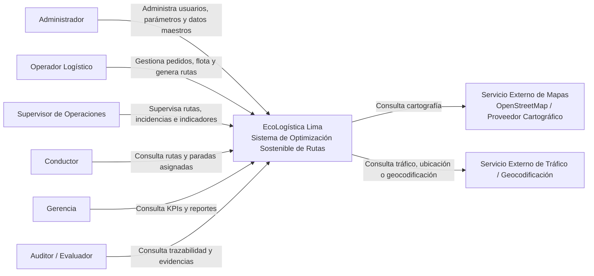
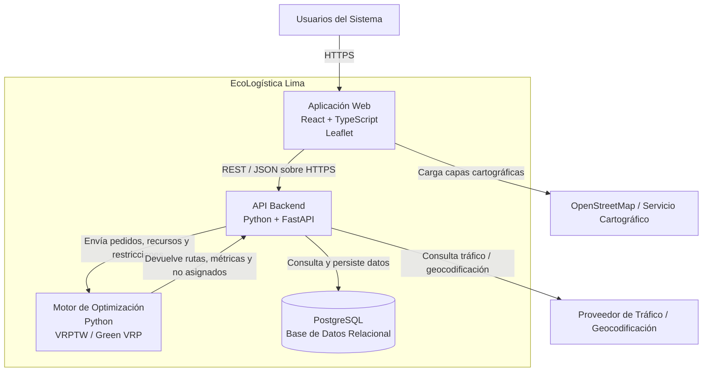
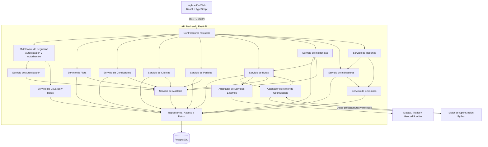

# Modelo C4

| Campo | Detalle |
|---|---|
| **Proyecto** | EcoLogística Lima – Optimizador de Rutas Sostenibles para DistriRápido S.A.C. |
| **Integrantes** | Luis Antony Gonzalo Guerrero, Jhon Robert Paitan Montes, Marco Jhair Martinez Llanos, Rodrigo Vladimir Arce Curi |
| **Fecha** | 01/09/2026 |
| **Versión** | 1.0.0 |

## 1. Objetivo del Documento

Definir la arquitectura de software de **EcoLogística Lima** mediante el modelo **C4**, representando progresivamente el sistema desde su contexto general hasta la estructura interna de sus principales componentes.

El documento incluye:

1. **Nivel 1 – Contexto:** actores y sistemas externos que interactúan con EcoLogística Lima.
2. **Nivel 2 – Contenedores:** principales unidades ejecutables y de almacenamiento.
3. **Nivel 3 – Componentes:** organización interna del backend y sus responsabilidades.

La arquitectura se alinea con el stack tecnológico seleccionado:

- **Frontend:** React + TypeScript
- **Backend:** Python + FastAPI
- **Base de datos:** PostgreSQL
- **Mapas:** Leaflet + OpenStreetMap
- **Motor de optimización:** Python
- **Comunicación:** REST / JSON sobre HTTPS

---

# 2. Principios Arquitectónicos

La arquitectura de EcoLogística Lima se diseña bajo los siguientes principios:

1. Separación de responsabilidades.
2. Bajo acoplamiento entre componentes.
3. Alta cohesión dentro de cada módulo.
4. Separación entre interfaz, lógica de negocio y persistencia.
5. Motor de optimización desacoplado del frontend y de la persistencia.
6. Seguridad aplicada en cada operación protegida.
7. Persistencia relacional con integridad referencial.
8. Trazabilidad de operaciones críticas.
9. Posibilidad de escalar componentes de forma independiente.
10. Integración controlada con servicios externos.

---

# 3. Nivel 1 – Diagrama de Contexto



---

# 4. Nivel 2 – Diagrama de Contenedores

## 4.1. Descripción

EcoLogística Lima se divide en los siguientes contenedores principales:

- **Aplicación Web:** React + TypeScript + Leaflet.
- **API Backend:** Python + FastAPI.
- **Motor de Optimización:** Python.
- **Base de Datos:** PostgreSQL.

El **motor de optimización no accede directamente a PostgreSQL**. El backend obtiene los datos, prepara la entrada para el motor, recibe el resultado y persiste la planificación.

## 4.2. Diagrama de Contenedores



---

# 5. Responsabilidades por Contenedor

| Contenedor | Responsabilidad Principal |
|---|---|
| Aplicación Web | Interacción con usuarios |
| API Backend | Lógica de aplicación, acceso a datos y coordinación |
| Motor de Optimización | Cálculo y re-optimización de rutas |
| PostgreSQL | Persistencia y consistencia de datos |
| Servicio de Mapas | Información cartográfica |
| Servicio de Tráfico | Información externa dinámica |

---

# 6. Comunicación entre Contenedores

| Origen | Destino | Protocolo / Formato | Propósito |
|---|---|---|---|
| Navegador | Frontend | HTTPS | Acceso al sistema |
| Frontend | Backend | REST / JSON sobre HTTPS | Operaciones de negocio |
| Backend | PostgreSQL | PostgreSQL Protocol | Lectura y escritura |
| Backend | Motor de Optimización | Interfaz interna / llamada de servicio | Enviar datos y solicitar cálculo |
| Motor de Optimización | Backend | Objeto / JSON interno | Devolver rutas, métricas y excepciones |
| Frontend | OpenStreetMap | HTTPS | Capas cartográficas |
| Backend | Servicio de Tráfico | HTTPS / API | Información dinámica |

---

# 7. Nivel 3 – Diagrama de Componentes del Backend



---

# 8. Flujo Arquitectónico de Generación de Rutas

```mermaid
sequenceDiagram
    actor O as Operador
    participant FE as Frontend
    participant API as FastAPI
    participant R as Servicio de Rutas
    participant DB as PostgreSQL
    participant OPT as Motor de Optimización

    O->>FE: Solicita generar rutas
    FE->>API: POST /api/v1/rutas/generar
    API->>R: Procesar solicitud

    R->>DB: Consultar pedidos, vehículos y conductores
    DB-->>R: Datos vigentes

    R->>OPT: Enviar datos y restricciones
    OPT-->>R: Rutas + métricas + no asignados

    R->>DB: Guardar planificación
    DB-->>R: Confirmación

    R-->>API: Resultado
    API-->>FE: 201 Created + JSON
```

---

# 9. Decisión Arquitectónica Principal

El motor de optimización se mantiene **independiente de la persistencia**.

Esto implica que:

1. El backend consulta PostgreSQL.
2. El backend transforma los datos al formato requerido por el motor.
3. El motor recibe únicamente los datos necesarios para resolver el problema.
4. El motor devuelve rutas, métricas y pedidos no asignados.
5. El backend valida y persiste los resultados.

### Beneficios

- Menor acoplamiento.
- Mayor facilidad para pruebas unitarias.
- Posibilidad de sustituir el motor sin modificar la base de datos.
- Mejor separación de responsabilidades.
- Mayor mantenibilidad.
- Mayor facilidad para escalar el motor de forma independiente.

---

# 10. Conclusión

La arquitectura C4 propuesta separa correctamente:

- Interfaz de usuario.
- API y servicios de dominio.
- Persistencia.
- Motor de optimización.
- Integraciones externas.

El backend actúa como coordinador central entre PostgreSQL y el motor de optimización, evitando que el componente algorítmico dependa directamente de la infraestructura de persistencia.
