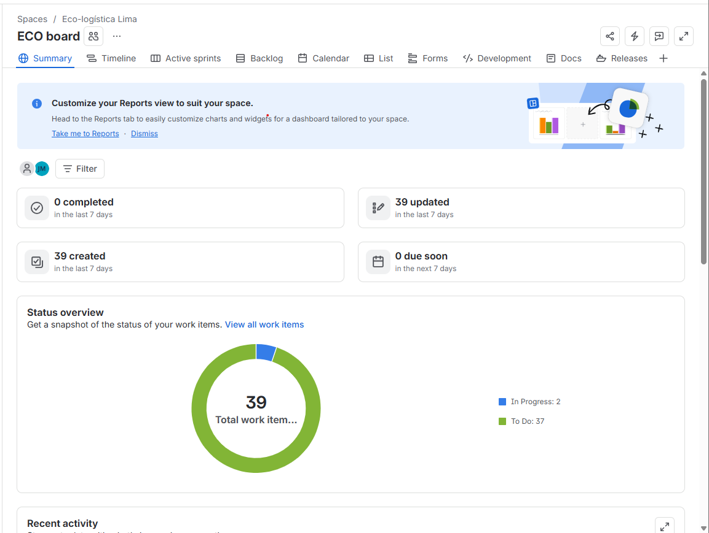
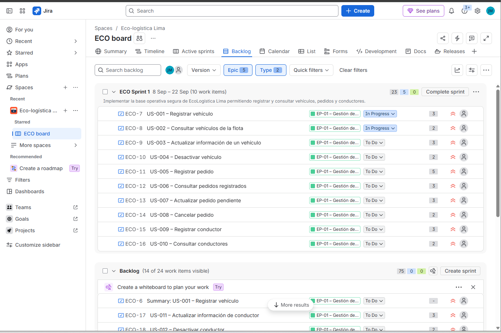
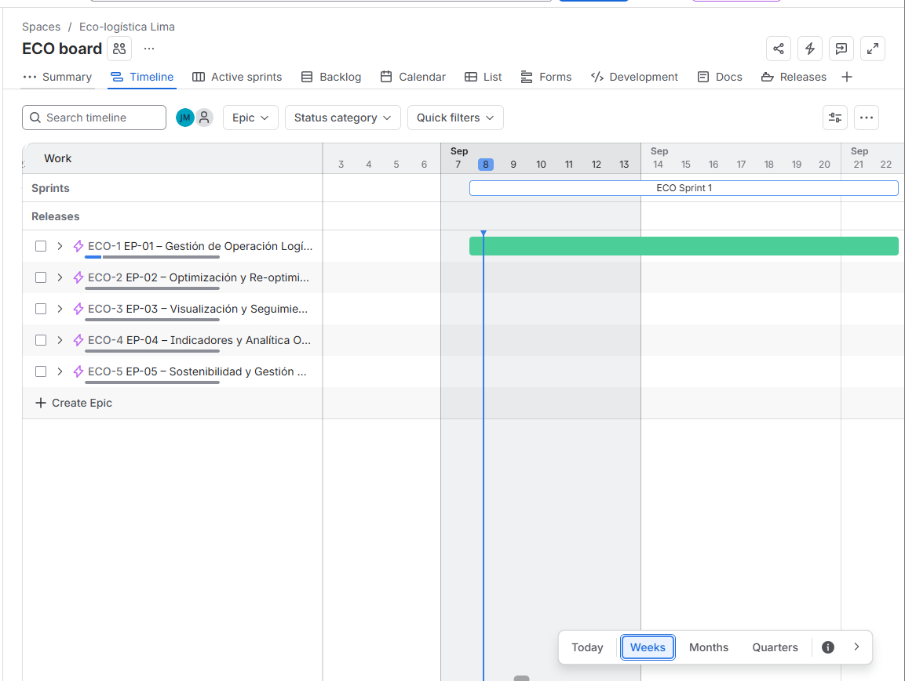
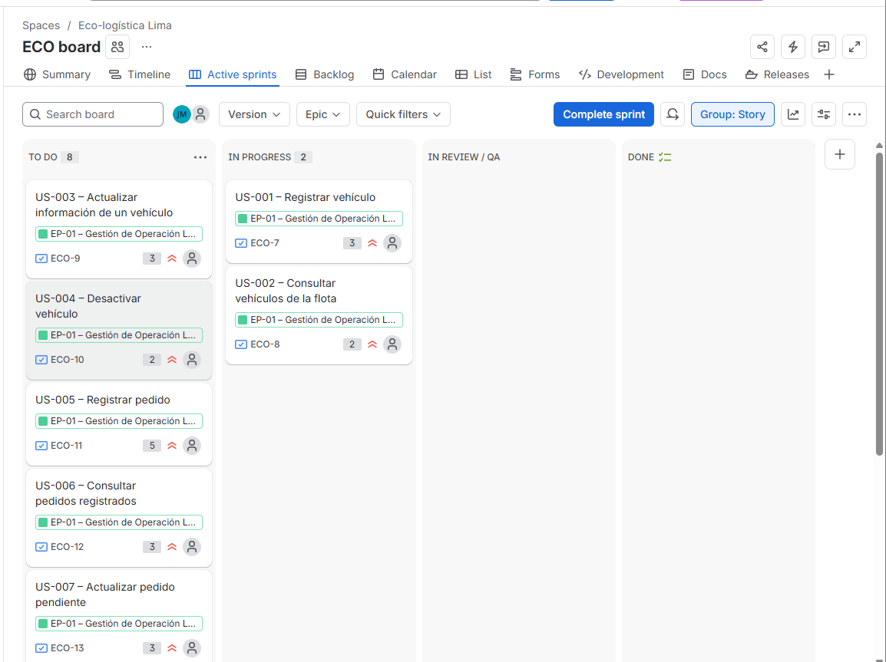
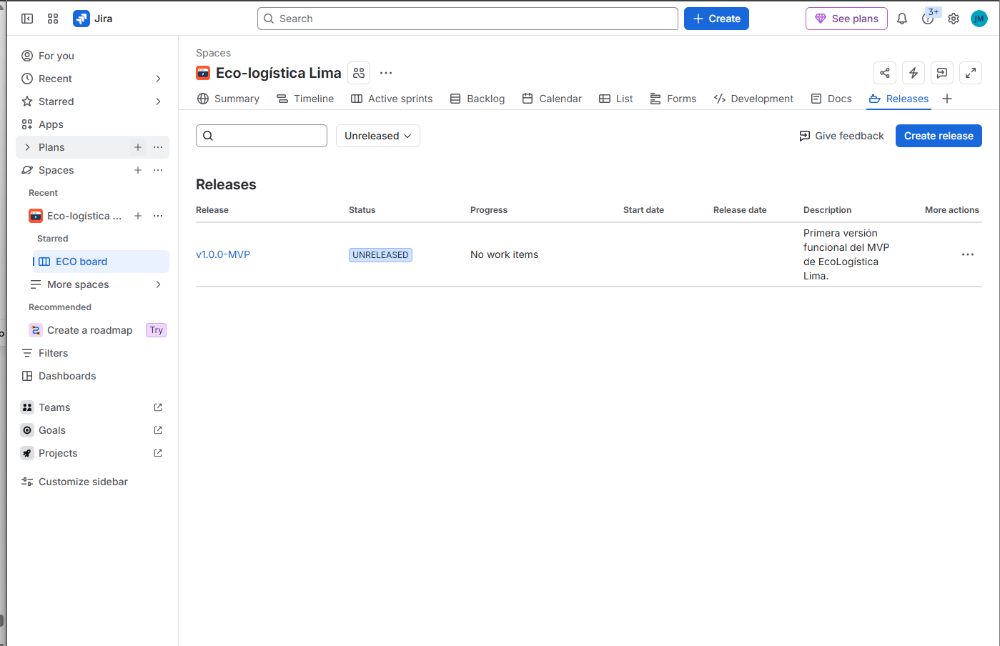

[← Volver al README Principal](../../README.md)

# Artefactos Jira

| Campo | Detalle |
|---|---|
| **Proyecto** | EcoLogística Lima – Optimizador de Rutas Sostenibles para DistriRápido S.A.C. |
| **Integrantes** | Luis Antony Gonzalo Guerrero, Jhon Robert Paitan Montes, Marco Jhair Martinez Llanos, Rodrigo Vladimir Arce Curi |
| **Fecha** | 08/09/2026 |
| **Versión** | 1.0.0 |
| **Herramienta ALM** | Atlassian Jira Software |
| **Metodología** | Scrum |

---

## 1. Objetivo del documento

Documentar la configuración operativa de **EcoLogística Lima** en Atlassian Jira Software y presentar evidencia visual de los principales artefactos de planificación ágil exigidos para la Fase 02 del PFA.

La configuración contempla Épicas, Historias de Usuario, Enablers, Product Backlog, Story Points, Sprint 1, Sprint Goal, tablero Scrum, Timeline/Roadmap y Releases.

---

## 2. Configuración general

El proyecto fue configurado en Jira Software con enfoque **Scrum Company-managed**.

### Jerarquía

```text
Epic
├── Story
│   └── Sub-task
├── Task / Enabler
└── Bug
```

### Épicas

| ID | Épica |
|---|---|
| EP-01 | Gestión de Operación Logística |
| EP-02 | Optimización y Re-optimización de Rutas |
| EP-03 | Visualización y Seguimiento de Rutas |
| EP-04 | Indicadores y Analítica Operativa |
| EP-05 | Sostenibilidad y Gestión Ambiental |

Las Historias de Usuario fueron estimadas mediante **Story Points** utilizando Fibonacci: `1, 2, 3, 5, 8, 13`.

---

# 3. Evidencias de Jira

## 3.1. Evidencia 1 – Roadmap / Timeline

**Descripción:**  
El Timeline muestra la planificación temporal de las cinco Épicas del proyecto.

> **Pendiente:** insertar captura del Timeline/Roadmap con las 5 Épicas.





---

## 3.2. Evidencia 2 – Backlog Priorizado

**Descripción:**  
El Product Backlog contiene las Historias de Usuario y Enablers derivados de la línea base de requisitos, con estimación en Story Points y asociación con sus Épicas.

> **Pendiente:** insertar captura del Backlog con Story Points visibles.

```md

```

---

## 3.3. Evidencia 3 – Sprint Planning y Sprint Goal

**Sprint:** ECO Sprint 1  
**Duración:** 2 semanas

### Sprint Goal

> **Implementar la base operativa de EcoLogística Lima para registrar y consultar vehículos, pedidos y conductores.**

El Sprint 1 prioriza capacidades de la Épica **EP-01 – Gestión de Operación Logística**.

> **Pendiente:** insertar captura donde se visualicen los ítems del Sprint 1 y el Sprint Goal.

```md

```

---

## 3.4. Evidencia 4 – Tablero Scrum Activo

El tablero Scrum utiliza el flujo:

```text
To Do → In Progress → In Review / QA → Done
```

La captura evidencia el Sprint activo, Historias de Usuario visibles, Story Points y elementos en progreso.

 

---

## 3.5. Evidencia 5 – Gestión de Versiones / Release

| Campo | Valor |
|---|---|
| **Versión** | `v1.0.0-MVP` |
| **Estado** | Unreleased |
| **Objetivo** | Agrupar el alcance funcional correspondiente a la primera versión del MVP de EcoLogística Lima. |

> **Pendiente:** insertar captura del módulo Releases mostrando `v1.0.0-MVP`.

```md

```

---

# 4. Resumen de cumplimiento

| Requisito | Estado |
|---|---|
| Proyecto Scrum configurado | ✅ |
| 5 Épicas creadas | ✅ |
| Historias de Usuario creadas | ✅ |
| Story Points asignados | ✅ |
| Sprint 1 creado | ✅ |
| Sprint de 2 semanas | ✅ |
| Sprint Goal definido | ✅ |
| Tablero Scrum activo | ✅ |
| Flujo `To Do → In Progress → In Review / QA → Done` | ✅ |
| Release `v1.0.0-MVP` creada | ✅ |
| Evidencia del tablero | ✅ |
| Evidencia de Roadmap | ⚠️ Pendiente |
| Evidencia de Backlog | ⚠️ Pendiente |
| Evidencia de Sprint Goal | ⚠️ Pendiente |
| Evidencia de Release | ⚠️ Pendiente |

---

# 5. Capturas pendientes antes de entregar

Solo faltan estas cuatro capturas:

1. `evidencia_01_roadmap.png` – Timeline con las 5 Épicas.
2. `evidencia_02_backlog.png` – Backlog con Story Points visibles.
3. `evidencia_03_sprint_planning.png` – Sprint 1 y Sprint Goal.
4. `evidencia_05_release.png` – Release `v1.0.0-MVP`.

Las capturas deben estar recortadas solo al contenido relevante de Jira, sin escritorio, barra de tareas ni pestañas del navegador.

---

# 6. Historial de control de cambios

| Versión | Fecha | Descripción |
|---|---|---|
| 1.0.0 | 08/09/2026 | Creación inicial del informe de evidencias Jira para la Fase 02 de Planificación. |

---

[← Volver al README Principal](../../README.md)
