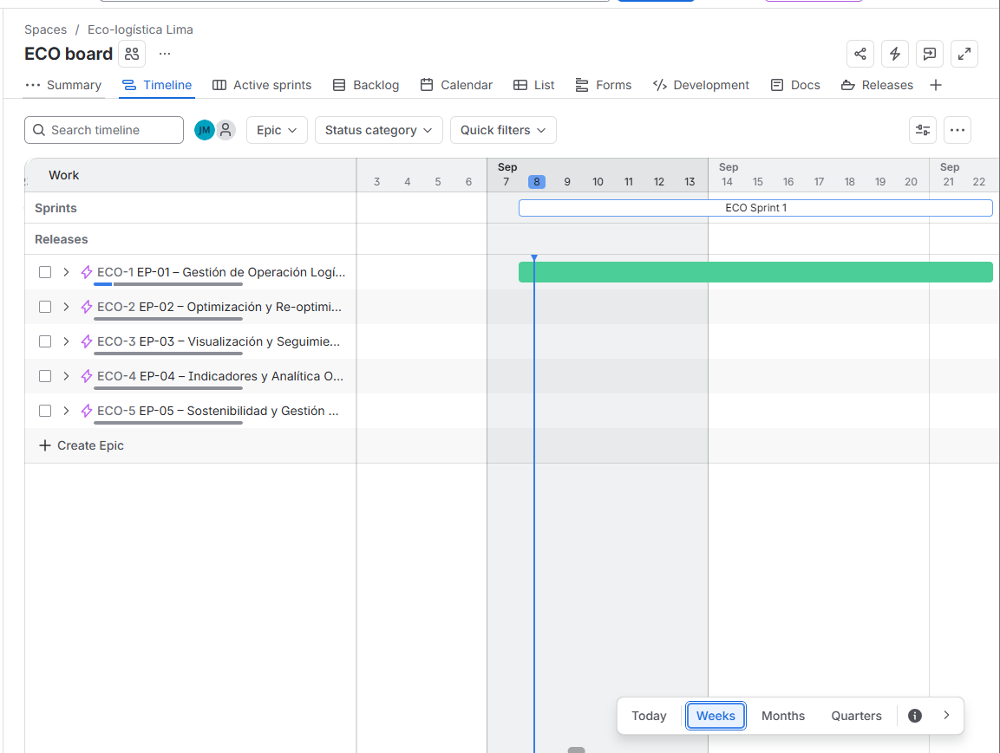
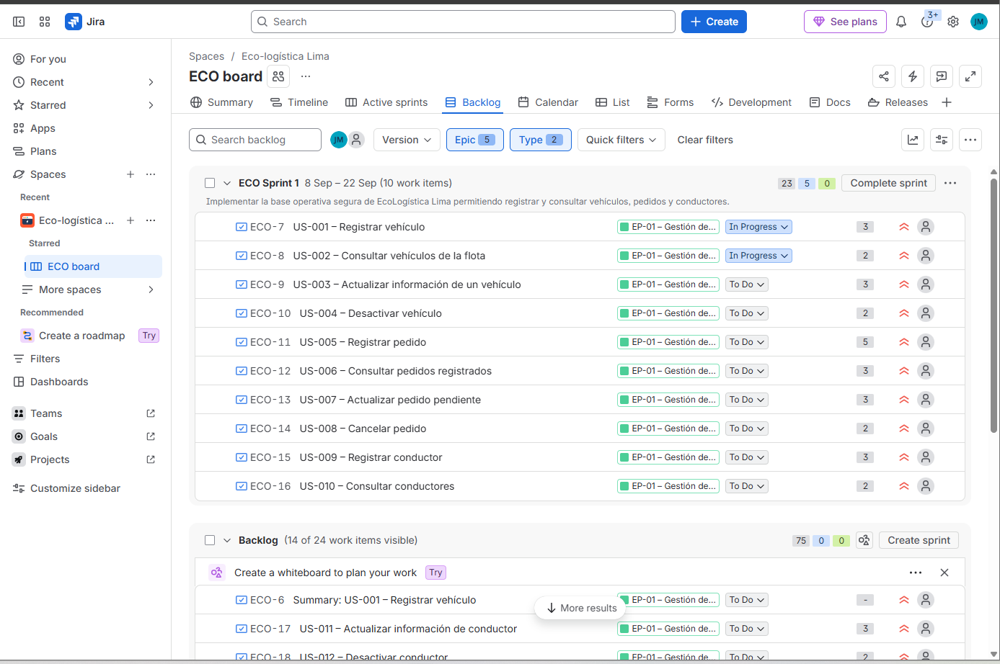
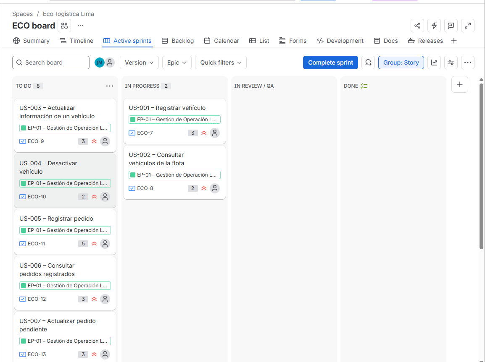
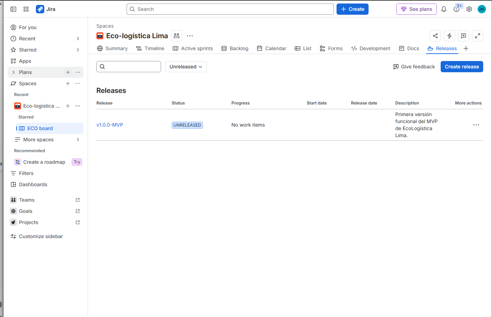

[← Volver al README Principal](../../README.md)

# Artefactos Jira

| Campo | Detalle |
|---|---|
| **Proyecto** | EcoLogística Lima – Optimizador de Rutas Sostenibles para DistriRápido S.A.C. |
| **Integrantes consignados en la planificación inicial** | Luis Antony Gonzalo Guerrero, Jhon Robert Paitan Montes, Marco Jhair Martinez Llanos, Rodrigo Vladimir Arce Curi |
| **Fecha** | 08/09/2026 |
| **Última revisión** | 06/10/2026 |
| **Versión** | 1.0.2 |
| **Herramienta ALM** | Atlassian Jira Software |
| **Metodología** | Scrum |

---

## 1. Objetivo del documento

Documentar la configuración operativa de **EcoLogística Lima** en Atlassian Jira Software y presentar evidencia visual de los principales artefactos de planificación ágil exigidos para la Fase 02 del PFA.

La configuración contempla Épicas, Historias de Usuario, Enablers, Product Backlog, Story Points, Sprint 1, Sprint Goal, tablero Scrum, Timeline/Roadmap y Releases.

Este documento conserva la evidencia histórica del Sprint 1. El equipo actual de cinco integrantes figura en el [README principal](../../README.md); no se conoce la fecha de incorporación del quinto integrante y por ello no se altera la lista original. El estado del Sprint 2 se registra en el [seguimiento separado](04%20Seguimiento%20Jira%20Sprint%202%20V_1_0_3.md).

---

## 2. Configuración general

El proyecto fue configurado en Jira Software con enfoque **Scrum Company-managed**.

### Jerarquía

```text
Epic
├── Story
│   └── Sub-task
├── Task / Enabler
└── Bug
```

### Épicas

| ID | Épica |
|---|---|
| EP-01 | Gestión de Operación Logística |
| EP-02 | Optimización y Re-optimización de Rutas |
| EP-03 | Visualización y Seguimiento de Rutas |
| EP-04 | Indicadores y Analítica Operativa |
| EP-05 | Sostenibilidad y Gestión Ambiental |

Las Historias de Usuario fueron estimadas mediante **Story Points** utilizando Fibonacci: `1, 2, 3, 5, 8, 13`.

---

# 3. Evidencias de Jira

## 3.1. Evidencia 1 – Roadmap / Timeline

**Descripción:**  
La captura del Timeline muestra las cinco épicas y el Sprint 1 en la planificación de septiembre. Corresponde al momento de la captura; no acredita el estado actual de las historias.





---

## 3.2. Evidencia 2 – Backlog Priorizado

**Descripción:**  
La captura del Backlog muestra US-001 a US-010 dentro de ECO Sprint 1, su estimación en Story Points y su asociación con EP-01. Se trata de evidencia de planificación, no de aceptación final.





---

## 3.3. Evidencia 3 – Sprint Planning y Sprint Goal

**Sprint:** ECO Sprint 1  
**Duración:** 2 semanas

### Sprint Goal

> **Implementar la base operativa segura de EcoLogística Lima permitiendo registrar y consultar vehículos, pedidos y conductores.**

El Sprint 1 prioriza capacidades de la Épica **EP-01 – Gestión de Operación Logística**. La misma captura de Backlog usada arriba muestra el nombre del Sprint, las diez historias y el Sprint Goal. No existe una captura independiente de la reunión de planificación.


---

## 3.4. Evidencia 4 – Tablero Scrum en la captura de planificación

El tablero Scrum utiliza el flujo:

```text
To Do → In Progress → In Review / QA → Done
```

La captura histórica muestra el Sprint activo en ese momento, las historias visibles, Story Points y elementos en progreso. No se utiliza para afirmar que las historias estén `Done` el 29/09/2026.

 

---

## 3.5. Evidencia 5 – Gestión de Versiones / Release

| Campo | Valor |
|---|---|
| **Versión** | `v1.0.0-MVP` |
| **Estado** | Unreleased |
| **Objetivo** | Agrupar el alcance funcional correspondiente a la primera versión del MVP de EcoLogística Lima. |





---

# 4. Resumen de evidencias de planificación

Los estados siguientes indican qué se **ve en las capturas guardadas**. No certifican el estado actual de Jira ni el Definition of Done de las historias del Sprint 1.

| Requisito | Estado |
|---|---|
| Proyecto Scrum configurado | ✅ |
| 5 Épicas creadas | ✅ |
| Historias de Usuario creadas | ✅ |
| Story Points asignados | ✅ |
| Sprint 1 creado | ✅ |
| Sprint de 2 semanas | ✅ |
| Sprint Goal definido | ✅ |
| Tablero Scrum de la planificación capturado | ✅ |
| Flujo `To Do → In Progress → In Review / QA → Done` | ✅ |
| Release `v1.0.0-MVP` creada | ✅ |
| Evidencia del tablero | ✅ |
| Evidencia de Roadmap / Timeline | ✅ `evidencia_01_roadmap.png` |
| Evidencia de Backlog | ✅ `evidencia_02_backlog.png` |
| Evidencia de Sprint Goal | ✅ Visible en `evidencia_02_backlog.png`; sin captura independiente de la reunión |
| Evidencia de Release | ✅ `evidencia_05_release.png` |

---

# 5. Alcance temporal de las capturas

Las capturas guardadas muestran la configuración de Jira en la fase de planificación:

1. `evidencia_01_roadmap.png`: Timeline con las cinco épicas y ECO Sprint 1.
2. `evidencia_02_backlog.png`: Backlog con US-001 a US-010, Story Points y Sprint Goal; sirve para las secciones 3.2 y 3.3.
3. `evidencia_04_tablero_scrum.png`: tablero con historias en `To Do` e `In Progress` en la fecha de captura.
4. `evidencia_05_release.png`: release `v1.0.0-MVP` en estado `Unreleased`.

`evidencia_00_resumen.png` conserva la captura anterior del resumen de Jira, que estaba etiquetada erróneamente como Roadmap. No se usa como prueba del Timeline. El estado del código y las verificaciones del 29/09/2026 se registran en el [informe del Sprint 1](../03%20Implementación/Sprint%201/01%20Informe%20de%20estado%20del%20proyecto%20V_1_0_0.md). El [seguimiento de Jira del Sprint 2](04%20Seguimiento%20Jira%20Sprint%202%20V_1_0_3.md) documenta una consulta nueva; no reinterpreta estas capturas históricas como evidencia del Sprint 2.

---

# 6. Historial de control de cambios

| Versión | Fecha | Descripción |
|---|---|---|
| 1.0.0 | 08/09/2026 | Creación inicial del informe de evidencias Jira para la Fase 02 de Planificación. |
| 1.0.1 | 29/09/2026 | Corrección de referencias a capturas, estados de evidencia y distinción entre planificación histórica y avance del Sprint 1. |
| 1.0.2 | 06/10/2026 | Actualización del enlace al informe histórico del Sprint 1; distinción entre equipo inicial y actual, y referencia al seguimiento verificado del Sprint 2. |

---

[← Volver al README Principal](../../README.md)
