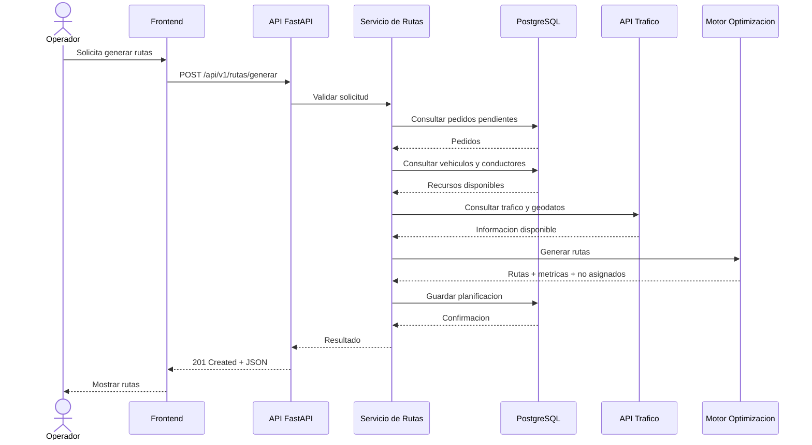
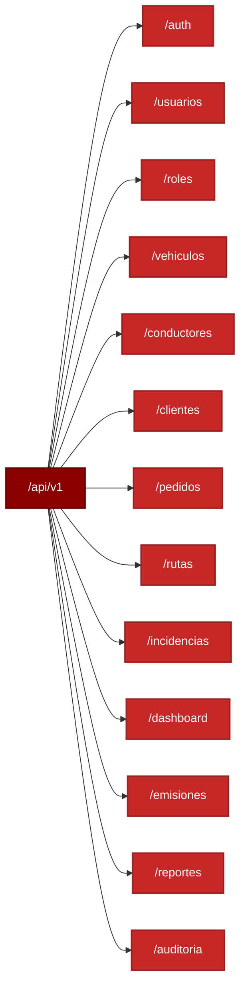

# Diagrama de APIs — EcoLogística Lima

## Arquitectura de APIs

```mermaid
flowchart TB

    %% =========================
    %% CLIENTE
    %% =========================

    Frontend["Aplicación Web<br/><br/>React + TypeScript<br/><br/>Consume los servicios de EcoLogística Lima<br/>mediante REST / JSON sobre HTTPS."]

    %% =========================
    %% API PRINCIPAL
    %% =========================

    subgraph API["API REST — EcoLogística Lima /api/v1"]

        direction TB

        Auth["/auth<br/><br/>POST /login<br/>POST /logout<br/>GET /me"]

        Usuarios["/usuarios y /roles<br/><br/>Gestión de usuarios,<br/>roles y permisos"]

        Vehiculos["/vehiculos<br/><br/>Gestión de flota<br/>y disponibilidad"]

        Conductores["/conductores<br/><br/>Gestión de conductores<br/>y disponibilidad"]

        Clientes["/clientes<br/><br/>Clientes, preferencias<br/>y restricciones"]

        Pedidos["/pedidos<br/><br/>Registro, consulta,<br/>actualización y cancelación"]

        Rutas["/rutas<br/><br/>Generación, consulta<br/>y re-optimización"]

        Incidencias["/incidencias<br/><br/>Registro y gestión<br/>de eventos operativos"]

        Dashboard["/dashboard<br/><br/>KPIs operativos,<br/>económicos y ambientales"]

        Emisiones["/emisiones<br/><br/>Cálculo y seguimiento<br/>de CO2"]

        Reportes["/reportes<br/><br/>Reportes operativos<br/>y de sostenibilidad"]

        Auditoria["/auditoria<br/><br/>Consulta de eventos<br/>y trazabilidad"]
    end

    %% =========================
    %% COMPONENTES INTERNOS
    %% =========================

    Motor["Motor de Optimización<br/><br/>Python<br/>VRPTW / Green VRP"]

    BaseDatos[("PostgreSQL<br/><br/>Usuarios · Pedidos · Vehículos<br/>Conductores · Rutas · Incidencias<br/>Emisiones · Auditoría")]

    %% =========================
    %% SISTEMAS EXTERNOS
    %% =========================

    Mapas["OpenStreetMap<br/><br/>Servicio externo<br/>de cartografía"]

    Trafico["Tráfico / Geocodificación<br/><br/>Servicio externo<br/>de información dinámica"]

    %% =========================
    %% RELACIONES CLIENTE - API
    %% =========================

    Frontend -->|"HTTPS / JSON"| Auth
    Frontend --> Usuarios
    Frontend --> Vehiculos
    Frontend --> Conductores
    Frontend --> Clientes
    Frontend --> Pedidos
    Frontend --> Rutas
    Frontend --> Incidencias
    Frontend --> Dashboard
    Frontend --> Emisiones
    Frontend --> Reportes
    Frontend --> Auditoria

    %% =========================
    %% RELACIONES CON DATOS
    %% =========================

    Auth -->|"Consulta usuarios y roles"| BaseDatos
    Usuarios -->|"CRUD"| BaseDatos
    Vehiculos -->|"CRUD"| BaseDatos
    Conductores -->|"CRUD"| BaseDatos
    Clientes -->|"CRUD"| BaseDatos
    Pedidos -->|"CRUD"| BaseDatos
    Incidencias -->|"CRUD"| BaseDatos
    Dashboard -->|"Consulta métricas"| BaseDatos
    Emisiones -->|"Lee y registra cálculos"| BaseDatos
    Reportes -->|"Consulta información"| BaseDatos
    Auditoria -->|"Consulta eventos"| BaseDatos

    %% =========================
    %% OPTIMIZACIÓN
    %% =========================

    Rutas -->|"Generar / re-optimizar"| Motor
    Motor -->|"Consulta datos operativos"| BaseDatos
    Motor -->|"Rutas y métricas"| Rutas
    Rutas -->|"Guarda planificación"| BaseDatos

    %% =========================
    %% SERVICIOS EXTERNOS
    %% =========================

    Rutas -->|"Consulta tráfico y geocodificación"| Trafico
    Frontend -->|"Carga capas cartográficas"| Mapas

    %% =========================
    %% ESTILOS
    %% =========================

    classDef client fill:#8B0000,color:#FFFFFF,stroke:#650000,stroke-width:2px;
    classDef api fill:#C62828,color:#FFFFFF,stroke:#9E1F1F,stroke-width:2px;
    classDef internal fill:#B71C1C,color:#FFFFFF,stroke:#7F0000,stroke-width:2px;
    classDef external fill:#9E9E9E,color:#FFFFFF,stroke:#707070,stroke-width:2px;

    class Frontend client;
    class Auth,Usuarios,Vehiculos,Conductores,Clientes,Pedidos,Rutas,Incidencias,Dashboard,Emisiones,Reportes,Auditoria api;
    class Motor,BaseDatos internal;
    class Mapas,Trafico external;

    style API fill:#FFFFFF,stroke:#D32F2F,stroke-width:2px,stroke-dasharray:8 6
```

---

## Flujo principal de generación de rutas

```mermaid
sequenceDiagram

    actor Operador
    participant Frontend
    participant API as API FastAPI
    participant Rutas as Servicio de Rutas
    participant DB as PostgreSQL
    participant Trafico as API Trafico
    participant Motor as Motor Optimizacion

    Operador->>Frontend: Solicita generar rutas
    Frontend->>API: POST /api/v1/rutas/generar

    API->>Rutas: Validar solicitud
    Rutas->>DB: Consultar pedidos pendientes
    DB-->>Rutas: Pedidos

    Rutas->>DB: Consultar vehiculos y conductores
    DB-->>Rutas: Recursos disponibles

    Rutas->>Trafico: Consultar trafico y geodatos
    Trafico-->>Rutas: Informacion disponible

    Rutas->>Motor: Generar rutas
    Motor-->>Rutas: Rutas + metricas + no asignados

    Rutas->>DB: Guardar planificacion
    DB-->>Rutas: Confirmacion

    Rutas-->>API: Resultado
    API-->>Frontend: 201 Created + JSON
    Frontend-->>Operador: Mostrar rutas
```

---

## Endpoints principales

```mermaid
flowchart LR

    API["/api/v1"]

    API --> Auth["/auth"]
    API --> Usuarios["/usuarios"]
    API --> Roles["/roles"]
    API --> Vehiculos["/vehiculos"]
    API --> Conductores["/conductores"]
    API --> Clientes["/clientes"]
    API --> Pedidos["/pedidos"]
    API --> Rutas["/rutas"]
    API --> Incidencias["/incidencias"]
    API --> Dashboard["/dashboard"]
    API --> Emisiones["/emisiones"]
    API --> Reportes["/reportes"]
    API --> Auditoria["/auditoria"]

    classDef root fill:#8B0000,color:#FFFFFF,stroke:#650000,stroke-width:2px;
    classDef endpoint fill:#C62828,color:#FFFFFF,stroke:#9E1F1F,stroke-width:2px;

    class API root;
    class Auth,Usuarios,Roles,Vehiculos,Conductores,Clientes,Pedidos,Rutas,Incidencias,Dashboard,Emisiones,Reportes,Auditoria endpoint;
```
