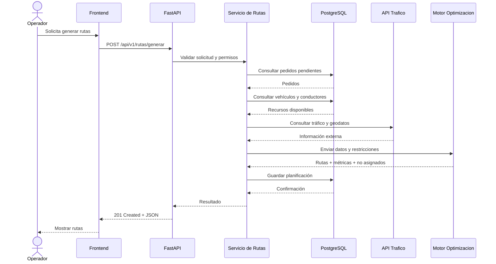
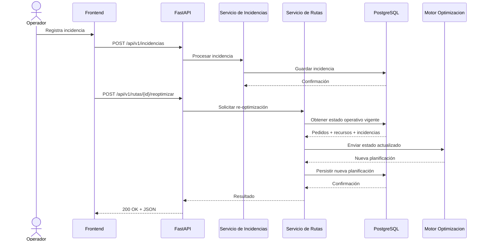
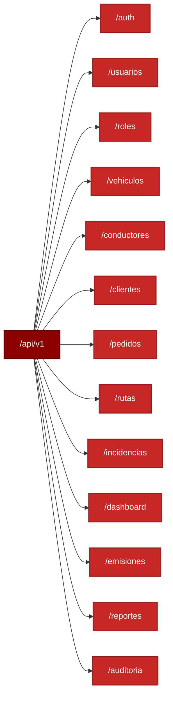

# Diagrama de APIs — EcoLogística Lima

## Arquitectura de APIs

```mermaid
flowchart TB

    Frontend["Aplicación Web<br/><br/>React + TypeScript"]

    subgraph API["API REST — EcoLogística Lima /api/v1"]

        direction TB

        Auth["/auth"]
        Usuarios["/usuarios y /roles"]
        Vehiculos["/vehiculos"]
        Conductores["/conductores"]
        Clientes["/clientes"]
        Pedidos["/pedidos"]
        Rutas["/rutas"]
        Incidencias["/incidencias"]
        Dashboard["/dashboard"]
        Emisiones["/emisiones"]
        Reportes["/reportes"]
        Auditoria["/auditoria"]
    end

    Motor["Motor de Optimización<br/>Python<br/>VRPTW / Green VRP"]
    BaseDatos[("PostgreSQL")]
    Mapas["OpenStreetMap"]
    Trafico["Tráfico / Geocodificación"]

    Frontend -->|"HTTPS / JSON"| Auth
    Frontend --> Usuarios
    Frontend --> Vehiculos
    Frontend --> Conductores
    Frontend --> Clientes
    Frontend --> Pedidos
    Frontend --> Rutas
    Frontend --> Incidencias
    Frontend --> Dashboard
    Frontend --> Emisiones
    Frontend --> Reportes
    Frontend --> Auditoria

    Auth --> BaseDatos
    Usuarios --> BaseDatos
    Vehiculos --> BaseDatos
    Conductores --> BaseDatos
    Clientes --> BaseDatos
    Pedidos --> BaseDatos
    Incidencias --> BaseDatos
    Dashboard --> BaseDatos
    Emisiones --> BaseDatos
    Reportes --> BaseDatos
    Auditoria --> BaseDatos

    Rutas -->|"Consulta datos vigentes"| BaseDatos
    Rutas -->|"Envía datos preparados"| Motor
    Motor -->|"Devuelve rutas y métricas"| Rutas
    Rutas -->|"Persiste planificación"| BaseDatos

    Rutas --> Trafico
    Frontend --> Mapas

    classDef client fill:#8B0000,color:#FFFFFF,stroke:#650000,stroke-width:2px;
    classDef api fill:#C62828,color:#FFFFFF,stroke:#9E1F1F,stroke-width:2px;
    classDef internal fill:#B71C1C,color:#FFFFFF,stroke:#7F0000,stroke-width:2px;
    classDef external fill:#9E9E9E,color:#FFFFFF,stroke:#707070,stroke-width:2px;

    class Frontend client;
    class Auth,Usuarios,Vehiculos,Conductores,Clientes,Pedidos,Rutas,Incidencias,Dashboard,Emisiones,Reportes,Auditoria api;
    class Motor,BaseDatos internal;
    class Mapas,Trafico external;

    style API fill:#FFFFFF,stroke:#D32F2F,stroke-width:2px,stroke-dasharray:8 6
```



---

## Flujo de generación de rutas



---

## Flujo de re-optimización



---

## Endpoints principales



---

## Endpoints clave de rutas

| Método | Endpoint | Descripción |
|---|---|---|
| GET | `/api/v1/rutas` | Listar rutas |
| GET | `/api/v1/rutas/{id}` | Consultar una ruta |
| POST | `/api/v1/rutas/generar` | Generar planificación optimizada |
| POST | `/api/v1/rutas/{id}/reoptimizar` | Re-optimizar una ruta activa |
| GET | `/api/v1/rutas/{id}/paradas` | Consultar paradas |
| GET | `/api/v1/rutas/{id}/metricas` | Consultar métricas |

---

## Decisión de Arquitectura

El motor de optimización **no consume PostgreSQL directamente**.

El flujo correcto es:

```text
PostgreSQL <-> FastAPI / Servicio de Rutas <-> Motor de Optimización
```

El backend:

1. Consulta la información necesaria.
2. Valida reglas de negocio.
3. Prepara los datos de entrada.
4. Invoca el motor.
5. Recibe rutas y métricas.
6. Persiste los resultados.
