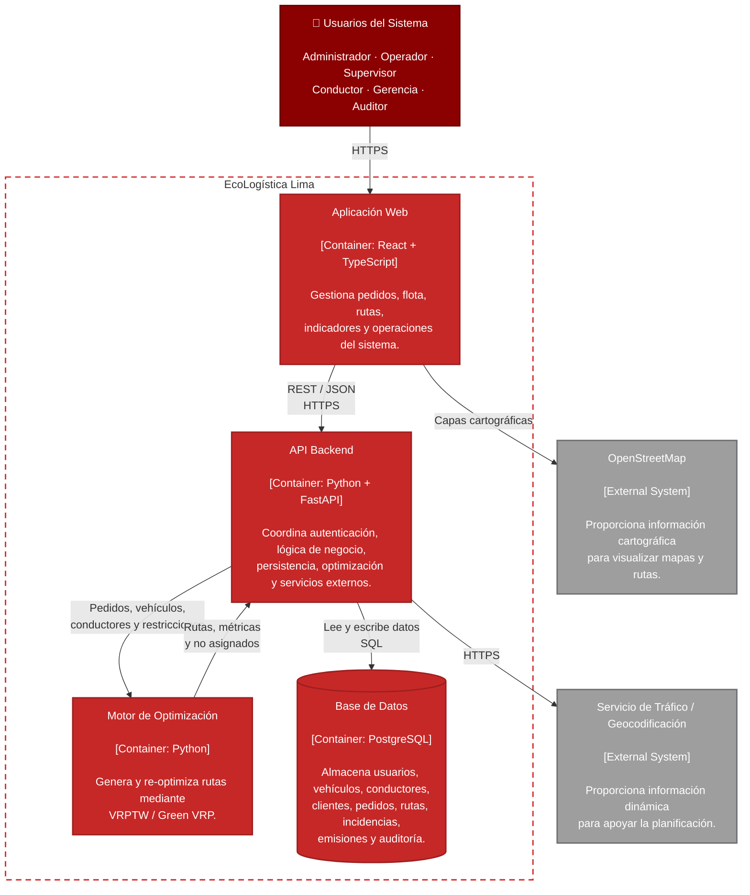
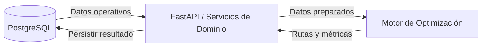

# C4 — Diagrama de Contenedores

## EcoLogística Lima

---

## Flujo principal

> El motor de optimización no accede directamente a PostgreSQL. El backend controla la lectura, preparación y persistencia de los datos.
