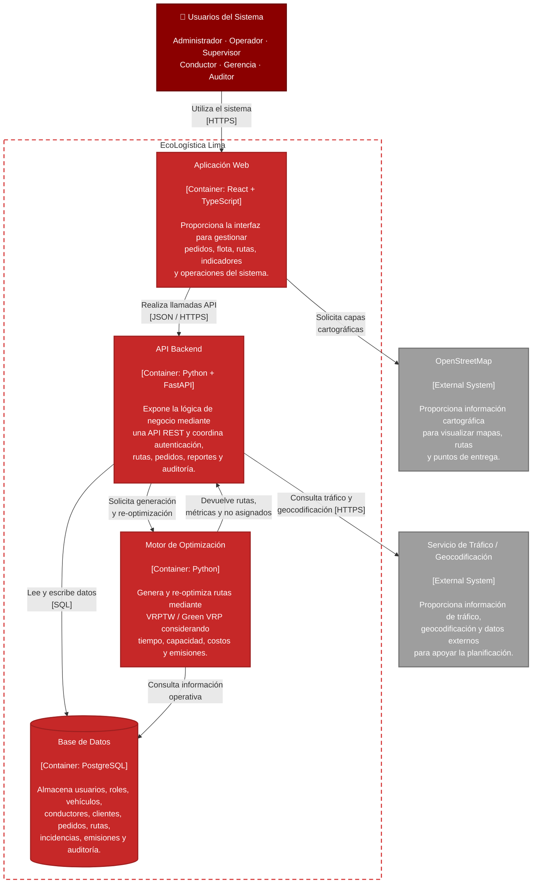

# C4 — Diagrama de Contenedores

## EcoLogística Lima

---

## Vista de la arquitectura

- **Usuarios** acceden al sistema mediante HTTPS.
- **Aplicación Web** utiliza React + TypeScript.
- **API Backend** utiliza FastAPI y concentra la lógica de negocio.
- **Motor de Optimización** procesa VRPTW / Green VRP.
- **PostgreSQL** almacena los datos del sistema.
- **OpenStreetMap** proporciona cartografía.
- Un **servicio externo de tráfico/geocodificación** aporta información dinámica para la planificación.
