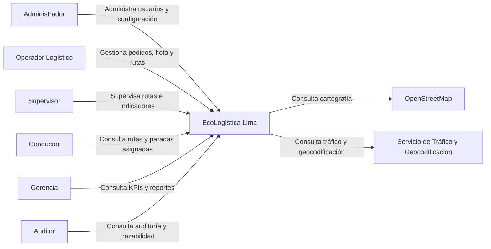
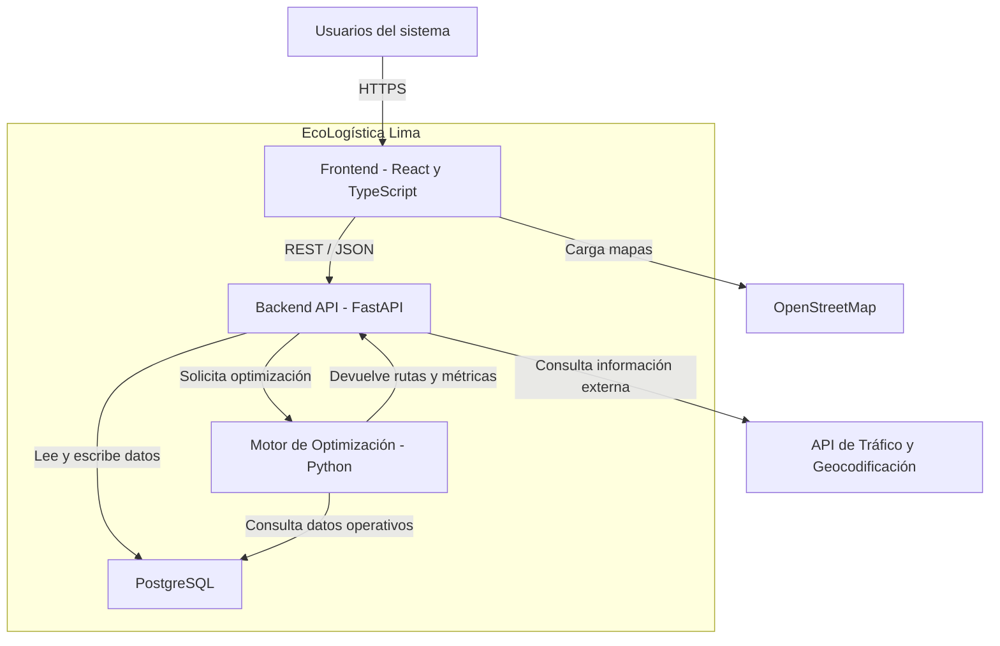
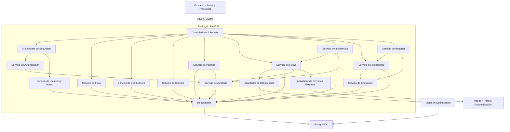
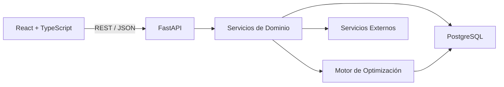

# Diagrama C4 — EcoLogística Lima

> Este documento usa únicamente sintaxis Mermaid básica compatible con el renderizado de GitHub.

---

## Nivel 1 — Contexto

---

## Nivel 2 — Contenedores

---

## Nivel 3 — Componentes del Backend

---

## Vista General Simplificada

